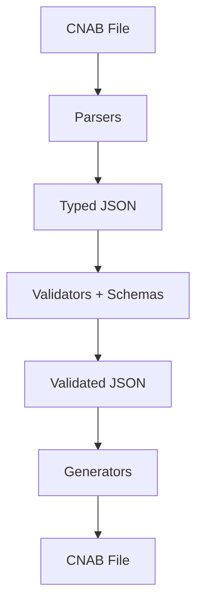

# Architecture

BoletoSDK is a TypeScript SDK for parsing and generating CNAB 240/400 files. The architecture separates concerns into parsers, generators, validators, utilities, and types.

## High-Level Structure

- `src/index.ts`: Public exports
- `src/parsers`: CNAB → JSON
- `src/generators`: JSON → CNAB
- `src/validators`: Structural and business validation
- `src/schemas`: Zod schemas for runtime validation
- `src/types`: TypeScript types
- `src/utils`: Formatting and helper utilities

## Data Flow

## Parsing Pipeline

1. Detect format (CNAB 240 vs 400)
2. Parse file header, details, and trailer
3. Convert date and numeric fields
4. Validate structure and business rules

## Generation Pipeline

1. Validate input structure
2. Format fields by position and length
3. Build fixed-length lines
4. Validate line length

## Error Handling

Custom error types provide context:

- `CnabError`
- `ParseError`
- `ValidationError`
- `GenerationError`

Errors include actionable messages and optional context data.

## Extension Points

- Add new banks by extending constants and validation rules
- Add new segments by introducing new parsers/generators
- Add new schemas for validation refinement
