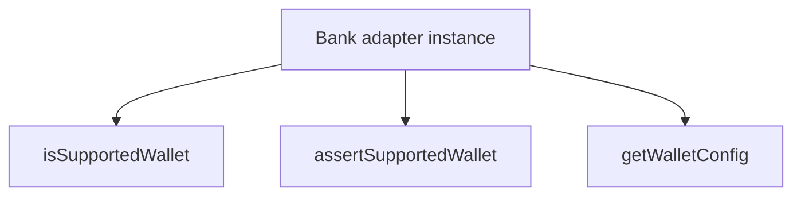

# IBankAdapter

## Overview

Defines a generic contract for bank-specific adapters used by the SDK.

## Responsibilities

- Standardize wallet support checks across adapters.
- Standardize wallet assertion behavior across adapters.
- Standardize wallet configuration lookup APIs across adapters.
- Standardize enriched CNAB400 remittance and return extraction from full content.
- Standardize enriched CNAB240 extraction from full content.

## Inputs and outputs

- Inputs:
  - `walletCode: string`
- Outputs:
  - `isSupportedWallet`: boolean
  - `assertSupportedWallet`: throws on invalid wallet
  - `getWalletConfig`: bank-specific wallet metadata or undefined

## API / Signature

```ts
export interface IBankAdapter<TWalletConfig = unknown> {
  isSupportedWallet(walletCode: string): boolean;
  assertSupportedWallet(walletCode: string): void;
  getWalletConfig(walletCode: string): TWalletConfig | undefined;
  buildRemittanceDetailsFromContent(content: string): TRemittanceDetail[];
  buildReturnDetailsFromContent(content: string): TReturnDetail[];
  buildCnab240DetailsFromContent(content: string): TCnab240Detail[];
}
```

## Main flow



## Error handling and edge cases

- The contract defines assertion semantics but does not prescribe concrete error messages.
- Wallet configuration lookup should return `undefined` when unsupported.

## Examples

```ts
function ensureSupportedWallet(adapter: IBankAdapter, walletCode: string): void {
  adapter.assertSupportedWallet(walletCode);
}
```

## Dependencies and integrations

- Implemented by bank-specific adapter facades (for example, `ItauAdapter`).
