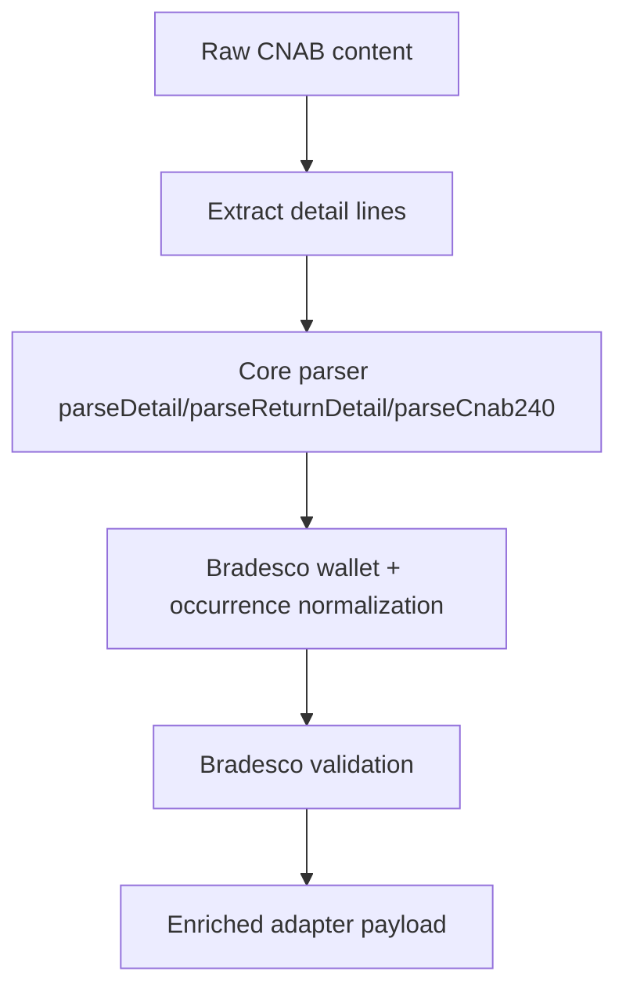

# adapters/bradesco/BradescoAdapter.ts

## Overview

Facade for Bradesco-specific helper flows and validation.

## Responsibilities

- Expose wallet support checks and wallet metadata resolution.
- Expose Bradesco "our number" formatting/build helpers.
- Expose occurrence mapping and field validation entrypoints.
- Build enriched CNAB240 detail payloads with wallet and occurrence metadata.
- Build enriched CNAB400 detail payloads from raw content using core CNAB parsers.

## Inputs and outputs

- Input: Wallet codes, base numbers, occurrence codes, Bradesco field objects, and CNAB content.
- Output: Validation results, normalized mappings, formatted values, and enriched adapter payloads.

## API / Signature

```ts
export class BradescoAdapter implements IBankAdapter<
  BradescoWalletConfig,
  BradescoCnab400RemittanceDetail,
  BradescoCnab400ReturnDetail,
  BradescoCnab240Segment
>;

export function createBradescoAdapter(): BradescoAdapter;
```

## Main flow



## Error handling and edge cases

- `assertSupportedWallet` throws for unsupported wallet codes.
- Invalid CNAB content errors are propagated from core parsers.
- Empty CNAB content returns empty arrays for content-based builders.

## Dependencies and integrations

- Integrates with `BradescoWalletValidator`, `BradescoOurNumberCalculator`, `BradescoOccurrenceMapper`, and `BradescoValidator`.
- Uses core CNAB parsers for raw-content processing.
- Implements `IBankAdapter` contract for SDK-level bank adapter polymorphism.
