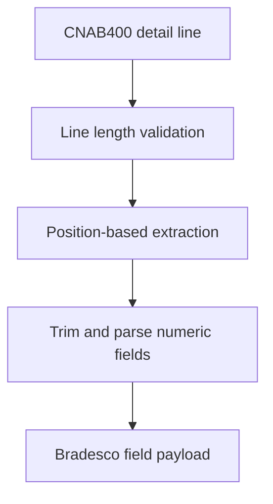

# adapters/bradesco/BradescoFieldParser.ts

## Overview

Parses Bradesco-specific fields from CNAB400 detail lines.

## Responsibilities

- Parse remittance fields used by Bradesco validation rules.
- Parse return fields used by Bradesco validation rules.
- Validate fixed CNAB400 line length before extraction.

## Inputs and outputs

- Input: 400-character CNAB400 detail line.
- Output: `BradescoRemittanceFields` or `BradescoReturnFields`.

## API / Signature

```ts
export function parseBradescoRemittanceFields(line: string): BradescoRemittanceFields;

export function parseBradescoReturnFields(line: string): BradescoReturnFields;
```

## Main flow



## Error handling and edge cases

- Throws when line length is not 400.
- Optional fields are returned as `undefined` when blank.

## Dependencies and integrations

- Uses CNAB400 position constants from `RECORD_POSITIONS`.
- Used by `BradescoAdapter` detail builders.
