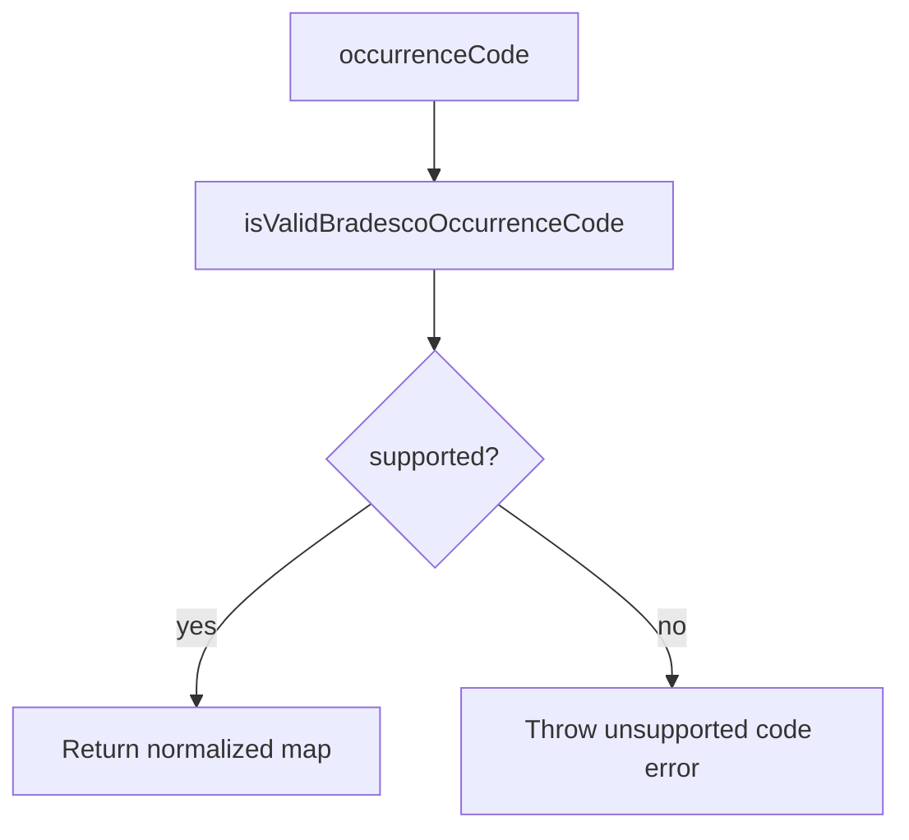

# adapters/bradesco/BradescoOccurrenceMapper.ts

## Overview

Maps Bradesco return occurrence codes to normalized semantic categories.

## Responsibilities

- Declare known Bradesco occurrence codes map.
- Validate whether an occurrence code is supported.
- Convert occurrence code into normalized semantic payload.

## Inputs and outputs

- Input: two-digit occurrence code string.
- Output: boolean validations or normalized mapping object.

## API / Signature

```ts
export const BRADESCO_OCCURRENCE_CODE_MAP: Record<
  BradescoOccurrenceCode,
  BradescoOccurrenceMapping
>;

export function isValidBradescoOccurrenceCode(
  occurrenceCode: string,
): occurrenceCode is BradescoOccurrenceCode;

export function mapBradescoOccurrenceCode(
  occurrenceCode: string,
): BradescoOccurrenceMapping;
```

## Main flow



## Error handling and edge cases

- Rejects non-numeric or non-two-digit values.
- Throws explicit error for unsupported codes.

## Examples

```ts
isValidBradescoOccurrenceCode('06'); // true
mapBradescoOccurrenceCode('06');
// { code: '06', category: 'settlement', description: 'Payment liquidation' }
```

## Dependencies and integrations

- Depends on `src/types/adapters/bradesco/index.ts`.
- Consumed by future Bradesco adapter facade and validators.
