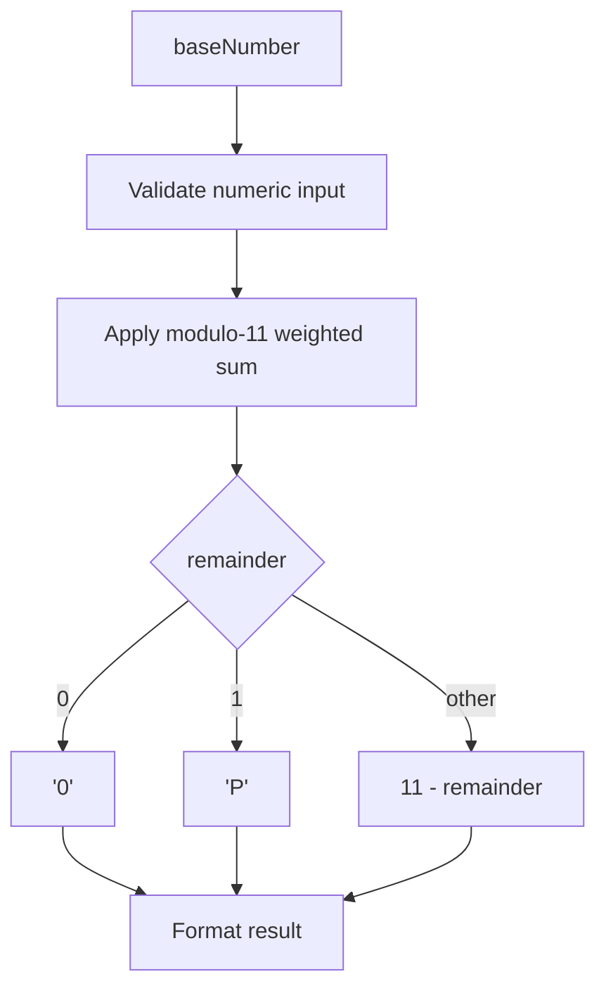

# adapters/bradesco/BradescoOurNumberCalculator.ts

## Overview

Calculates and formats Bradesco "our number" check digit using modulo 11 rules.

## Responsibilities

- Calculate check digit for Bradesco base numbers.
- Handle Bradesco-specific remainder rule that returns `P`.
- Format "our number" with check digit.
- Expose detailed structured result for callers.

## Inputs and outputs

- Input: numeric `baseNumber` string.
- Output: check digit, formatted value, and structured payload.

## API / Signature

```ts
export function calculateBradescoOurNumberCheckDigit(
  baseNumber: string,
): BradescoOurNumberCheckDigit;

export function formatBradescoOurNumber(baseNumber: string): string;

export function buildBradescoOurNumber(baseNumber: string): BradescoOurNumberResult;
```

## Main flow



## Error handling and edge cases

- Throws when input is empty.
- Throws when input contains non-numeric characters.
- Returns `P` for remainder 1 according to Bradesco rule.

## Examples

```ts
calculateBradescoOurNumberCheckDigit('12345678901'); // '8'
calculateBradescoOurNumberCheckDigit('00000000006'); // 'P'

formatBradescoOurNumber('12345678901'); // '12345678901-8'

buildBradescoOurNumber('12345678901');
// { baseNumber: '12345678901', checkDigit: '8', formatted: '12345678901-8' }
```

## Dependencies and integrations

- Depends on `src/types/adapters/bradesco/index.ts`.
- Consumed by future Bradesco adapter facade and validators.
