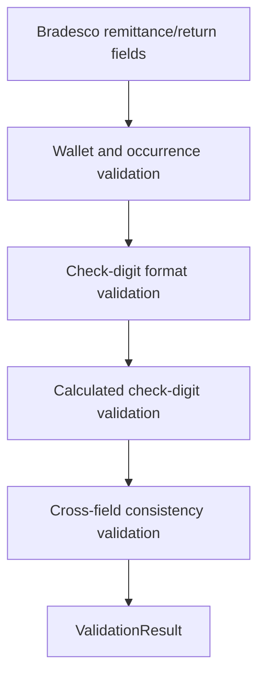

# adapters/bradesco/BradescoValidator.ts

## Overview

Validates Bradesco-specific remittance and return field sets.

## Responsibilities

- Validate remittance instruction, wallet, occurrence, and day-count constraints.
- Validate return wallet, occurrence, raw check-digit format, and calculated check digits.
- Assert valid remittance/return payloads for guarded flows.

## Inputs and outputs

- Input: `BradescoRemittanceFields` and `BradescoReturnFields`.
- Output: `ValidationResult` or thrown error by assertion helpers.

## API / Signature

```ts
export function validateBradescoRemittanceFields(
  fields: BradescoRemittanceFields,
): ValidationResult;

export function validateBradescoReturnFields(
  fields: BradescoReturnFields,
): ValidationResult;

export function assertValidBradescoRemittanceFields(
  fields: BradescoRemittanceFields,
): void;

export function assertValidBradescoReturnFields(
  fields: BradescoReturnFields,
): void;
```

## Main flow



## Error handling and edge cases

- Rejects unsupported wallet and occurrence codes.
- Rejects invalid raw check-digit format (must be `0-9` or `P`).
- Validates calculated check digits using Bradesco modulo-11 rules.
- Detects mismatch between `ourNumber` and `confirmedOurNumber`.

## Examples

```ts
validateBradescoRemittanceFields({
  instructionCode: '00',
  walletNumber: '19',
  walletType: 'R',
  occurrenceCode: '01',
  daysCount: 0,
});

validateBradescoReturnFields({
  walletNumber: '019',
  walletType: 'R',
  occurrenceCode: '06',
  ourNumber: '12345678901',
  ourNumberCheckDigit: '8',
});
```

## Dependencies and integrations

- Uses `BradescoWalletValidator`, `BradescoOccurrenceMapper`, and `BradescoOurNumberCalculator`.
- Consumed by future `BradescoAdapter` enrichment/validation flows.
