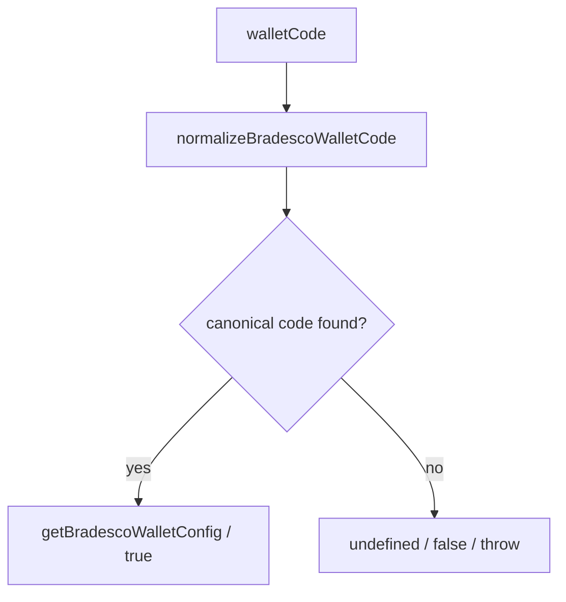

# adapters/bradesco/BradescoWalletValidator.ts

## Overview

Validates, normalizes, and resolves Bradesco wallet codes and metadata.

## Responsibilities

- Declare supported Bradesco wallets.
- Normalize wallet aliases to canonical values.
- Validate whether wallet code is supported.
- Resolve wallet configuration metadata.
- Assert supported wallet codes for guarded flows.

## Inputs and outputs

- Input: wallet code strings from caller or CNAB payload.
- Output: booleans, canonical codes, wallet metadata, or thrown errors.

## API / Signature

```ts
export const BRADESCO_SUPPORTED_WALLETS: readonly BradescoWalletCode[];

export function normalizeBradescoWalletCode(
  walletCode: string,
): BradescoWalletCode | undefined;

export function isValidBradescoWallet(walletCode: string): boolean;

export function getBradescoWalletConfig(
  walletCode: string,
): BradescoWalletConfig | undefined;

export function assertValidBradescoWallet(walletCode: string): void;
```

## Main flow



## Error handling and edge cases

- Returns `undefined` when wallet code is empty or unsupported.
- Accepts canonical and alias forms (for example `19` and `019`).
- Throws explicit error on assertion helper when code is unsupported.

## Examples

```ts
isValidBradescoWallet('19'); // true
isValidBradescoWallet('019'); // true
isValidBradescoWallet('99'); // false

getBradescoWalletConfig('026')?.code; // '26'
assertValidBradescoWallet('999'); // throws
```

## Dependencies and integrations

- Depends on `src/types/adapters/bradesco/index.ts`.
- Consumed by future Bradesco adapter facade.
