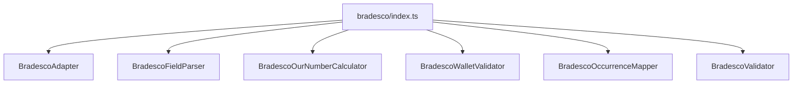

# adapters/bradesco/index.ts

## Overview

Public Bradesco adapter barrel for wallet, occurrence, our-number, and field-validation helpers.

## Responsibilities

- Re-export Bradesco adapter modules from a single entry point.

## Inputs and outputs

- Input: N/A
- Output: Re-exported Bradesco symbols.

## API / Signature

```ts
export * from './BradescoAdapter';
export * from './BradescoFieldParser';
export * from './BradescoOccurrenceMapper';
export * from './BradescoOurNumberCalculator';
export * from './BradescoValidator';
export * from './BradescoWalletValidator';
```

## Main flow



## Error handling and edge cases

- No runtime logic.

## Examples

```ts
import {
  buildBradescoOurNumber,
  isValidBradescoWallet,
} from '@linkiez/boleto-sdk';
```

## Dependencies and integrations

- Exposes Bradesco modules used by SDK consumers.
