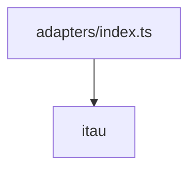

# adapters/index.ts

## Overview

Aggregates bank adapters exposed by the SDK.

## Responsibilities

- Re-export all available bank adapters.
- Keep adapter imports centralized.

## Inputs and outputs

- Input: N/A
- Output: Adapter exports.

## API / Signature

```ts
export * from './itau';
```

## Main flow



## Error handling and edge cases

- No runtime logic.

## Examples

```ts
import { ItauAdapter } from '@linkiez/boleto-sdk';
```

## Dependencies and integrations

- Depends on subfolder exports in `src/adapters/itau`.
