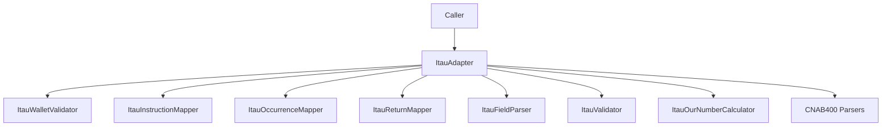

# ItauAdapter

## Overview

Facade class that groups Itaú-specific wallet, instruction, occurrence, CNAB400 field parsing, validation, and "our number" helper operations.
Implements the generic `IBankAdapter<ItauWalletConfig, ItauCnab400RemittanceDetail, ItauCnab400ReturnDetail, ItauCnab240Segment>` contract.

## Responsibilities

- Validate wallet support.
- Assert wallet validity for guarded flows.
- Resolve wallet configuration metadata from wallet code.
- Map Itaú remittance instruction codes.
- Map Itaú return occurrence codes.
- Map Itaú return liquidation codes.
- Normalize Itaú return rejection messages.
- Normalize short Itaú numeric rejection codes to canonical 8-digit form.
- Parse Itaú-specific CNAB400 detail fields for remittance and return records.
- Validate Itaú-specific CNAB400 remittance and return field sets.
- Build enriched Itaú CNAB400 remittance and return detail payloads.
- Map Itaú return liquidation and rejection metadata into normalized structures.
- Build enriched Itaú CNAB400 detail arrays from full file content.
- Resolve wallet configuration metadata in enriched CNAB400 payloads when wallet is supported.
- Build enriched Itaú CNAB240 detail payloads from parsed segments.
- Build enriched Itaú CNAB240 detail payloads from parsed batch and file structures.
- Build enriched Itaú CNAB240 detail payloads directly from raw file content.
- Resolve wallet configuration metadata in enriched CNAB240 payloads when wallet is supported.
- Accept reduced CNAB240 portfolio aliases during wallet resolution and CNAB240 validation flows.
- Format Itaú "our number" values.
- Build detailed Itaú "our number" results.
- Expose a factory helper for external consumers.

## Inputs and outputs

- Inputs:
  - `walletCode: string`
  - `instructionCode: string`
  - `occurrenceCode: string`
  - `line: string`
  - `baseNumber: string`
- Outputs:
  - Booleans, thrown errors, normalized instruction mappings, normalized occurrence mappings, parsed CNAB400 field objects, enriched CNAB400 detail payloads, formatted "our number" strings, and structured calculator results.

## API / Signature

```ts
export class ItauAdapter {
  isSupportedWallet(walletCode: string): boolean;
  assertSupportedWallet(walletCode: string): void;
  getWalletConfig(walletCode: string): ItauWalletConfig | undefined;
  mapInstructionCode(instructionCode: string): ItauInstructionMapping;
  mapOccurrenceCode(occurrenceCode: string): ItauOccurrenceMapping;
  mapLiquidationCode(liquidationCode: string): ItauLiquidationMapping;
  mapRejectionMessage(rejectionMessage: string | undefined):
    ItauRejectionMessageMapping | undefined;
  parseRemittanceFields(line: string): ItauRemittanceFields;
  parseReturnFields(line: string): ItauReturnFields;
  validateRemittanceFields(fields: ItauRemittanceFields): ValidationResult;
  validateReturnFields(fields: ItauReturnFields): ValidationResult;
  buildRemittanceDetail(line: string): ItauCnab400RemittanceDetail;
  buildReturnDetail(line: string): ItauCnab400ReturnDetail;
  buildRemittanceDetailsFromContent(content: string): ItauCnab400RemittanceDetail[];
  buildReturnDetailsFromContent(content: string): ItauCnab400ReturnDetail[];
  buildCnab240Detail(detail: Cnab240DetailRecord): ItauCnab240Segment;
  buildCnab240Details(details: Cnab240DetailRecord[]): ItauCnab240Segment[];
  buildCnab240DetailsFromBatch(batch: Cnab240Batch): ItauCnab240Segment[];
  buildCnab240DetailsFromFile(file: Cnab240File): ItauCnab240Segment[];
  buildCnab240DetailsFromContent(content: string): ItauCnab240Segment[];
  formatOurNumber(baseNumber: string): string;
  buildOurNumber(baseNumber: string): ItauOurNumberResult;
}

export function createItauAdapter(): ItauAdapter;
```

## Main flow



## Error handling and edge cases

- Propagates wallet assertion errors.
- Propagates instruction mapping errors for unsupported codes.
- Propagates occurrence mapping errors for unsupported codes.
- Propagates CNAB400 line validation errors for invalid detail records.
- Returns ValidationResult objects for remittance and return field sets.
- Returns enriched detail payloads with mapped values only when code mappings are supported.
- Propagates base number validation errors.

## Examples

```ts
const adapter = createItauAdapter();
adapter.assertSupportedWallet('109');
const wallet = adapter.getWalletConfig('109');
const instruction = adapter.mapInstructionCode('01');
const occurrence = adapter.mapOccurrenceCode('06');
const liquidation = adapter.mapLiquidationCode('02');
const rejection = adapter.mapRejectionMessage('12345678');
const shortRejection = adapter.mapRejectionMessage('1');
const remittanceFields = adapter.parseRemittanceFields(remittanceLine);
const validation = adapter.validateRemittanceFields(remittanceFields);
const remittanceDetail = adapter.buildRemittanceDetail(remittanceLine);
const returnDetail = adapter.buildReturnDetail(returnLine);
const remittanceDetails = adapter.buildRemittanceDetailsFromContent(remittanceContent);
const returnDetails = adapter.buildReturnDetailsFromContent(returnContent);
const cnab240Detail = adapter.buildCnab240Detail(parsedCnab240Detail);
const cnab240Details = adapter.buildCnab240Details(parsedCnab240Batch.details);
const cnab240BatchDetails = adapter.buildCnab240DetailsFromBatch(parsedCnab240Batch);
const cnab240FileDetails = adapter.buildCnab240DetailsFromFile(parsedCnab240File);
const cnab240ContentDetails = adapter.buildCnab240DetailsFromContent(cnab240Content);
const ourNumber = adapter.formatOurNumber('12345678');
const detailedOurNumber = adapter.buildOurNumber('12345678');
```

## Dependencies and integrations

- Depends on local calculator, field parser, instruction mapper, occurrence mapper, validator, and wallet validator modules.
