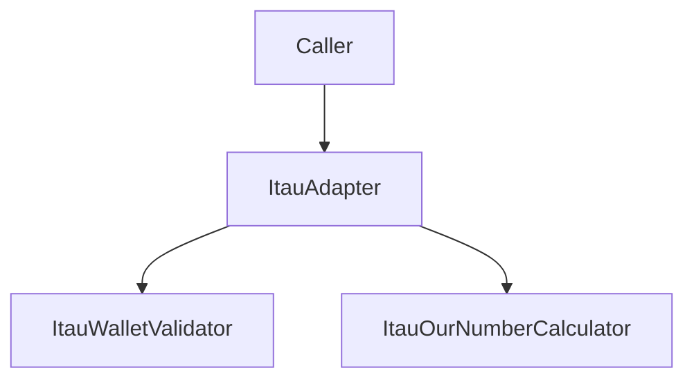

# ItauAdapter

## Overview

Facade class that groups Ita\u00fa-specific wallet and "our number" helper operations.

## Responsibilities

- Validate wallet support.
- Assert wallet validity for guarded flows.
- Format Ita\u00fa "our number" values.
- Build detailed Ita\u00fa "our number" results.
- Expose a factory helper for external consumers.

## Inputs and outputs

- Inputs:
  - `walletCode: string`
  - `baseNumber: string`
- Outputs:
  - Booleans, thrown errors, formatted "our number" strings, and structured calculator results.

## API / Signature

```ts
export class ItauAdapter {
  isSupportedWallet(walletCode: string): boolean;
  assertSupportedWallet(walletCode: string): void;
  formatOurNumber(baseNumber: string): string;
  buildOurNumber(baseNumber: string): ItauOurNumberResult;
}

export function createItauAdapter(): ItauAdapter;
```

## Main flow



## Error handling and edge cases

- Propagates wallet assertion errors.
- Propagates base number validation errors.

## Examples

```ts
const adapter = createItauAdapter();
adapter.assertSupportedWallet('109');
const ourNumber = adapter.formatOurNumber('12345678');
const detailedOurNumber = adapter.buildOurNumber('12345678');
```

## Dependencies and integrations

- Depends on local calculator and wallet validator modules.
