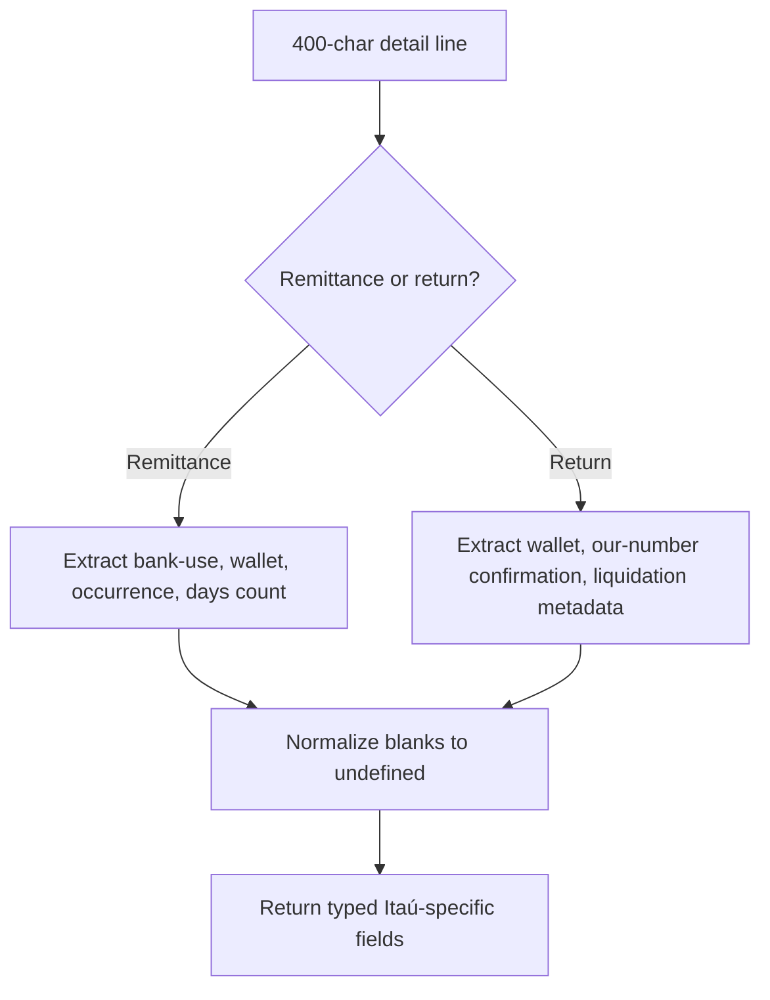

# ItauFieldParser

## Overview

Extracts Itaú-specific CNAB400 detail fields that sit outside the generic bank-agnostic parser contract, especially around wallet, bank-use, and return confirmation areas.

## Responsibilities

- Parse Itaú-specific fields from remittance detail records.
- Parse Itaú-specific fields from return detail records.
- Normalize blank areas to `undefined` when there is no useful value.
- Keep extraction focused on Itaú-only slices without changing the generic CNAB400 parser contract.

## Inputs and outputs

- Inputs:
  - `line: string`
- Outputs:
  - `parseItauRemittanceFields(line): ItauRemittanceFields`
  - `parseItauReturnFields(line): ItauReturnFields`

## API / Signature

```ts
export function parseItauRemittanceFields(line: string): ItauRemittanceFields;

export function parseItauReturnFields(line: string): ItauReturnFields;
```

## Main flow



## Error handling and edge cases

- Rejects lines that are not exactly 400 characters long.
- Preserves fixed numeric codes such as canceled instruction codes even when they are zero-filled.
- Converts blank informational areas into `undefined` to simplify downstream checks.

## Examples

```ts
const remittanceFields = parseItauRemittanceFields(remittanceLine);
// {
//   instructionCancellationCode: '0000',
//   walletNumber: '109',
//   walletType: 'I',
//   occurrenceCode: '01',
//   daysCount: 0,
// }

const returnFields = parseItauReturnFields(returnLine);
// {
//   walletNumber: '109',
//   walletType: 'I',
//   bankOurNumber: '00004965',
//   bankOurNumberDigit: '3',
//   confirmedOurNumber: '00004965',
//   canceledInstructionCode: '0000',
// }
```

## Dependencies and integrations

- Depends on CNAB400 line-length and field-position constants.
- Depends on `src/types/adapters/itau/index.ts`.
- Is consumed by `src/adapters/itau/ItauAdapter.ts`.