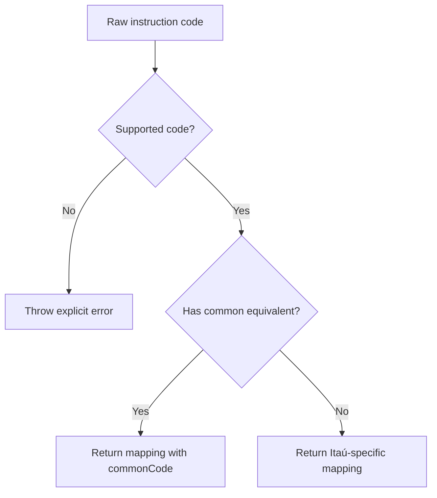

# ItauInstructionMapper

## Overview

Normalizes Itaú CNAB400 remittance instruction codes into SDK-friendly mappings and reuses common instruction codes when an equivalent exists.

## Responsibilities

- Declare the canonical map of supported Itaú instruction codes.
- Validate whether a raw instruction code is supported.
- Translate a bank-specific instruction into a normalized description.
- Reuse `CommonInstructionCode` for instructions that already exist in the shared domain.

## Inputs and outputs

- Inputs:
  - `instructionCode: string`
- Outputs:
  - `ITAU_INSTRUCTION_CODE_MAP`
  - `isValidItauInstructionCode(instructionCode)`
  - `mapItauInstructionCode(instructionCode)`

## API / Signature

```ts
export const ITAU_INSTRUCTION_CODE_MAP: Record<ItauInstructionCode, ItauInstructionMapping>;

export function isValidItauInstructionCode(
  instructionCode: string,
): instructionCode is ItauInstructionCode;

export function mapItauInstructionCode(instructionCode: string): ItauInstructionMapping;
```

## Main flow



## Error handling and edge cases

- Rejects non-numeric values.
- Rejects numeric codes not present in the Itaú instruction map.
- Keeps `commonCode` undefined when the SDK has no direct shared equivalent.

## Examples

```ts
mapItauInstructionCode('01');
// {
//   code: '01',
//   commonCode: CommonInstructionCode.PROTEST,
//   description: 'Protest automatically after N days',
// }

mapItauInstructionCode('15');
// {
//   code: '15',
//   description: 'Cancel protest and automatic negative',
// }
```

## Dependencies and integrations

- Depends on `src/enums/index.ts` for `CommonInstructionCode`.
- Depends on `src/types/adapters/itau/index.ts`.
- Is consumed by `src/adapters/itau/ItauAdapter.ts`.