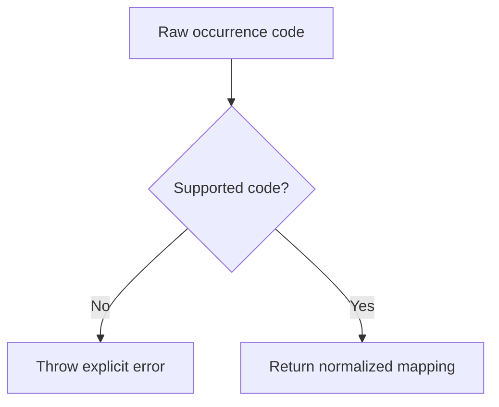

# ItauOccurrenceMapper

## Overview

Normalizes Itaú CNAB400 return occurrence codes into semantic categories that are easier for SDK consumers to handle.

## Responsibilities

- Declare the canonical map of supported Itaú occurrence codes.
- Validate whether a raw occurrence code is supported.
- Translate a bank-specific code into a normalized category and description.

## Inputs and outputs

- Inputs:
  - `occurrenceCode: string`
- Outputs:
  - `ITAU_OCCURRENCE_CODE_MAP`
  - `isValidItauOccurrenceCode(occurrenceCode)`
  - `mapItauOccurrenceCode(occurrenceCode)`

## API / Signature

```ts
export const ITAU_OCCURRENCE_CODE_MAP: Record<ItauOccurrenceCode, ItauOccurrenceMapping>;

export function isValidItauOccurrenceCode(
  occurrenceCode: string,
): occurrenceCode is ItauOccurrenceCode;

export function mapItauOccurrenceCode(occurrenceCode: string): ItauOccurrenceMapping;
```

## Main flow



## Error handling and edge cases

- Rejects non-numeric values.
- Rejects numeric codes not present in the Itaú occurrence map.
- Preserves the original bank code in the returned normalized object.

## Examples

```ts
isValidItauOccurrenceCode('06'); // true

mapItauOccurrenceCode('06');
// {
//   code: '06',
//   category: 'settlement',
//   description: 'Payment liquidation',
// }
```

## Dependencies and integrations

- Depends on `src/types/adapters/itau/index.ts`.
- Is consumed by `src/adapters/itau/ItauAdapter.ts`.