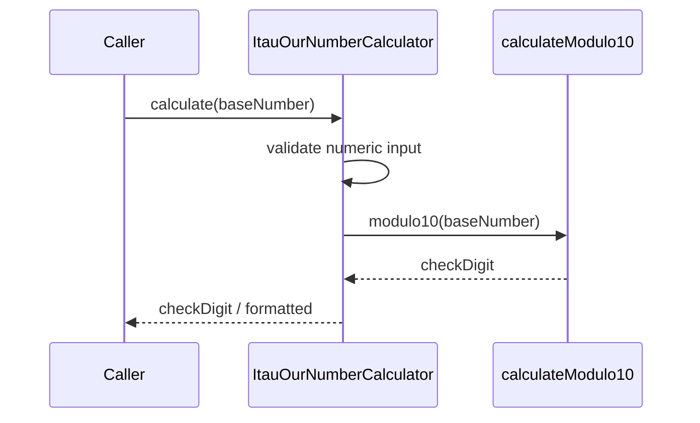

# ItauOurNumberCalculator

## Overview

Computes Ita\u00fa "our number" check digit using modulo 10 and formats the final value.

## Responsibilities

- Validate base number input.
- Compute modulo 10 check digit.
- Format output as base number + check digit.
- Provide structured calculation result.

## Inputs and outputs

- Inputs:
  - `baseNumber: string`
- Outputs:
  - `calculateItauOurNumberCheckDigit`: number
  - `formatItauOurNumber`: string
  - `buildItauOurNumber`: `ItauOurNumberResult`

## API / Signature

```ts
export function calculateItauOurNumberCheckDigit(baseNumber: string): number;
export function formatItauOurNumber(baseNumber: string): string;
export function buildItauOurNumber(baseNumber: string): ItauOurNumberResult;
```

## Main flow



## Error handling and edge cases

- Throws when base number is empty.
- Throws when base number contains non-digits.

## Examples

```ts
calculateItauOurNumberCheckDigit('12345678'); // 2
formatItauOurNumber('12345678'); // '123456782'
```

## Dependencies and integrations

- Uses `calculateModulo10` from `@utils/generators`.
- Uses `ItauOurNumberResult` from adapter types.
