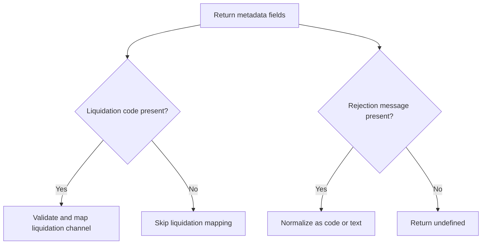

# ItauReturnMapper

## Overview

Maps Itaú CNAB400 return-only metadata that is not covered by occurrence mapping, focusing on liquidation channel codes and rejection message area normalization.

## Responsibilities

- Map supported Itaú liquidation codes to normalized semantic categories.
- Validate whether a liquidation code is supported.
- Trim surrounding whitespace from liquidation code input before validation and mapping.
- Normalize single-digit numeric liquidation codes to canonical 2-digit format.
- Normalize rejection message area into code-based or text-based metadata.
- Prioritize known rejection code catalog descriptions before generic fallback descriptions.
- Expose the source of each rejection description (`catalog`, `fallback`, `free-text`).
- Normalize numeric rejection codes to 8 digits before catalog/fallback resolution.
- Trim surrounding whitespace from rejection message content before normalization.

## Inputs and outputs

- Inputs:
  - `liquidationCode: string`
  - `rejectionMessage: string | undefined`
- Outputs:
  - `ItauLiquidationMapping`
  - `ItauRejectionMessageMapping | undefined`

## API / Signature

```ts
export const ITAU_LIQUIDATION_CODE_MAP: Record<ItauLiquidationCode, ItauLiquidationMapping>;

export function isValidItauLiquidationCode(
  liquidationCode: string,
): boolean;

export function mapItauLiquidationCode(liquidationCode: string): ItauLiquidationMapping;

export function mapItauRejectionMessage(
  rejectionMessage: string | undefined,
): ItauRejectionMessageMapping | undefined;
```

## Main flow



## Error handling and edge cases

- Rejects unsupported liquidation codes in strict mapping function.
- Returns `undefined` for empty rejection message area.
- Returns `undefined` for blank/whitespace-only rejection message area.
- Returns `undefined` for all-zero numeric rejection message payloads.
- Distinguishes numeric rejection payloads from free-text messages.
- Uses known-code descriptions when available, otherwise falls back to generic code description.
- Adds `source` metadata so SDK consumers can distinguish catalog-driven versus inferred descriptions.
- Converts short numeric codes (for example `1`) to canonical 8-digit codes (`00000001`).
- Includes a known-code catalog with common Itaú rejection causes (`00000001`, `00000002`, `00000003`, `00000004`, `00000005`, `00000006`, `00000010`).

## Examples

```ts
mapItauLiquidationCode('02');
// { code: '02', category: 'clearing', description: 'Liquidation channel 02 (clearing)' }

mapItauLiquidationCode(' 02 ');
// { code: '02', category: 'clearing', description: 'Liquidation channel 02 (clearing)' }

mapItauLiquidationCode('2');
// { code: '02', category: 'clearing', description: 'Liquidation channel 02 (clearing)' }

mapItauRejectionMessage('12345678');
// {
//   raw: '12345678',
//   category: 'code',
//   code: '12345678',
//   source: 'fallback',
//   description: 'Itaú rejection code from return message area: 12345678'
// }

mapItauRejectionMessage('00000001');
// {
//   raw: '00000001',
//   category: 'code',
//   code: '00000001',
//   source: 'catalog',
//   description: 'Rejected due to invalid wallet code'
// }

mapItauRejectionMessage('1');
// {
//   raw: '1',
//   category: 'code',
//   code: '00000001',
//   source: 'catalog',
//   description: 'Rejected due to invalid wallet code'
// }

mapItauRejectionMessage('123');
// {
//   raw: '123',
//   category: 'code',
//   code: '00000123',
//   source: 'fallback',
//   description: 'Itaú rejection code from return message area: 00000123'
// }

mapItauRejectionMessage('TITLEERR');
// {
//   raw: 'TITLEERR',
//   category: 'text',
//   source: 'free-text',
//   description: 'Itaú free-text rejection message from return message area'
// }

mapItauRejectionMessage('  TITLEERR  ');
// {
//   raw: 'TITLEERR',
//   category: 'text',
//   source: 'free-text',
//   description: 'Itaú free-text rejection message from return message area'
// }
```

## Dependencies and integrations

- Depends on `src/types/adapters/itau/index.ts`.
- Depends on `src/constants/bancos/ItauRejectionCodes.ts`.
- Consumed by `src/adapters/itau/ItauAdapter.ts`.
