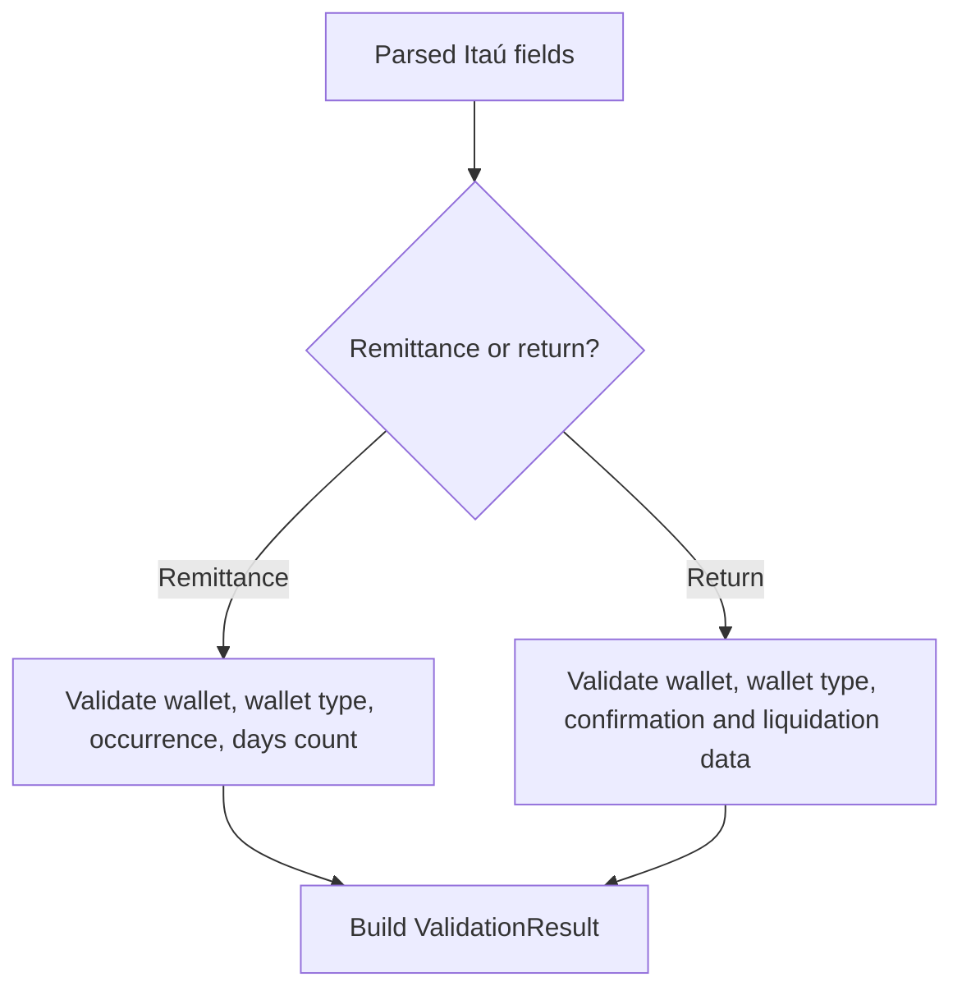

# ItauValidator

## Overview

Validates Itaú-specific CNAB400 remittance and return field sets using rules that combine wallet support, occurrence codes, and return confirmation data.

## Responsibilities

- Validate remittance field bundles extracted from Itaú CNAB400 detail records.
- Validate return field bundles extracted from Itaú CNAB400 detail records.
- Provide structured `ValidationResult` objects for caller-friendly error handling.
- Offer assert-style helpers when callers prefer exceptions.

## Inputs and outputs

- Inputs:
  - `fields: ItauRemittanceFields`
  - `fields: ItauReturnFields`
- Outputs:
  - `ValidationResult` objects for validation helpers.
  - `void` for assert helpers.

## API / Signature

```ts
export function validateItauRemittanceFields(fields: ItauRemittanceFields): ValidationResult;
export function validateItauReturnFields(fields: ItauReturnFields): ValidationResult;
export function assertValidItauRemittanceFields(fields: ItauRemittanceFields): void;
export function assertValidItauReturnFields(fields: ItauReturnFields): void;
```

## Main flow



## Error handling and edge cases

- Rejects remittance occurrence codes outside the Itaú rules, while allowing the remittance-specific `01` code used in the current layout.
- Rejects wallet numbers outside the supported Itaú set.
- Rejects return fields whose confirmed our-number does not match the bank our-number.
- Rejects malformed four-digit and two-digit control codes.
- Rejects invalid DDA indicator values outside `0` and `1`.
- Rejects malformed return credit dates.
- Requires return credit date when liquidation code is informed.

## Examples

```ts
const result = validateItauRemittanceFields({
  instructionCancellationCode: '0000',
  walletNumber: '109',
  walletType: 'I',
  occurrenceCode: '01',
  daysCount: 0,
});

if (!result.isValid) {
  throw new Error(result.errors.join(', '));
}
```

## Dependencies and integrations

- Depends on `src/types/adapters/itau/index.ts`.
- Depends on `src/validators/common/ValidationResult.ts`.
- Depends on the Itaú wallet, occurrence, and field parser helpers.
- Is consumed by `src/adapters/itau/ItauAdapter.ts`.