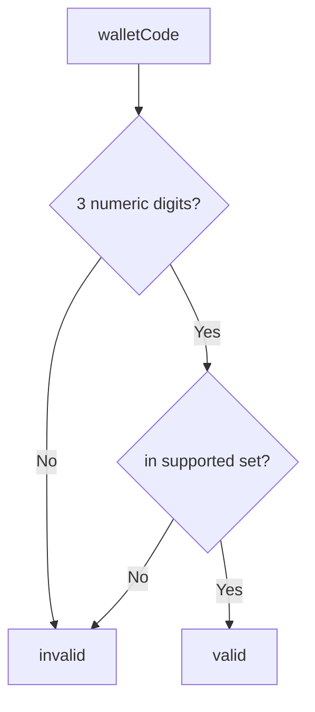

# ItauWalletValidator

## Overview

Validates Ita\u00fa wallet codes accepted by this SDK.

## Responsibilities

- Define supported wallet codes.
- Define wallet configuration metadata by supported code.
- Provide boolean validation helper.
- Provide wallet configuration resolver helper.
- Provide assertion helper for invalid wallets.

## Inputs and outputs

- Inputs:
  - `walletCode: string`
- Outputs:
  - `isValidItauWallet`: type guard boolean
  - `getItauWalletConfig`: wallet metadata or undefined
  - `assertValidItauWallet`: throws on invalid input

## API / Signature

```ts
export const ITAU_SUPPORTED_WALLETS: readonly ItauWalletCode[];
export const ITAU_WALLET_CONFIG_MAP: Record<ItauWalletCode, ItauWalletConfig>;
export function isValidItauWallet(walletCode: string): walletCode is ItauWalletCode;
export function getItauWalletConfig(walletCode: string): ItauWalletConfig | undefined;
export function assertValidItauWallet(walletCode: string): void;
```

## Main flow



## Error handling and edge cases

- Rejects non-numeric values.
- Rejects numeric values outside the supported set.
- Accepts reduced one-digit CNAB240 portfolio aliases when they map uniquely to a supported wallet.
- Assertion throws a clear error with provided code.

## Examples

```ts
isValidItauWallet('109'); // true
isValidItauWallet('999'); // false
getItauWalletConfig('109'); // { code: '109', ... }
getItauWalletConfig('9'); // { code: '109', ... }
getItauWalletConfig('999'); // undefined
assertValidItauWallet('112'); // no throw
```

## Dependencies and integrations

- Uses `ItauWalletCode` from adapter types.
