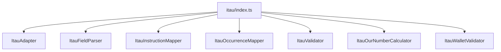

# adapters/itau/index.ts

## Overview

Public Itaú adapter barrel for calculator, field parser, instruction mapper, occurrence mapper, validator, and adapter facade.

## Responsibilities

- Re-export Itaú adapter APIs from a single file.

## Inputs and outputs

- Input: N/A
- Output: Re-exported Itaú adapter symbols.

## API / Signature

```ts
export * from './ItauAdapter';
export * from './ItauFieldParser';
export * from './ItauInstructionMapper';
export * from './ItauOccurrenceMapper';
export * from './ItauOurNumberCalculator';
export * from './ItauWalletValidator';
export * from './ItauValidator';
```

## Main flow



## Error handling and edge cases

- No runtime logic.

## Examples

```ts
import {
  createItauAdapter,
  parseItauRemittanceFields,
  validateItauRemittanceFields,
  isValidItauWallet,
  mapItauInstructionCode,
  mapItauOccurrenceCode,
} from '@linkiez/boleto-sdk';

const adapter = createItauAdapter();
const remittanceFields = parseItauRemittanceFields(remittanceLine);
const validation = validateItauRemittanceFields(remittanceFields);
const instruction = mapItauInstructionCode('01');
const occurrence = mapItauOccurrenceCode('06');
```

## Dependencies and integrations

- Exposes Itaú modules used by SDK consumers.
