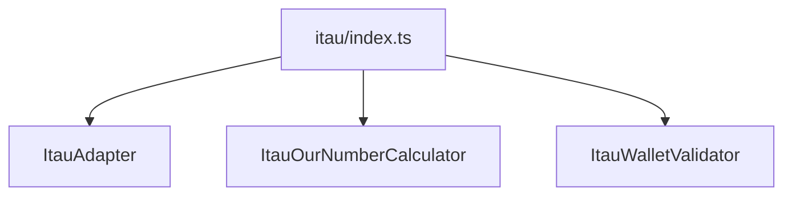

# adapters/itau/index.ts

## Overview

Public Ita\u00fa adapter barrel for calculator, validator, and adapter facade.

## Responsibilities

- Re-export Ita\u00fa adapter APIs from a single file.

## Inputs and outputs

- Input: N/A
- Output: Re-exported Ita\u00fa adapter symbols.

## API / Signature

```ts
export * from './ItauAdapter';
export * from './ItauOurNumberCalculator';
export * from './ItauWalletValidator';
```

## Main flow



## Error handling and edge cases

- No runtime logic.

## Examples

```ts
import { createItauAdapter, isValidItauWallet } from '@linkiez/boleto-sdk';

const adapter = createItauAdapter();
```

## Dependencies and integrations

- Exposes Ita\u00fa modules used by SDK consumers.
