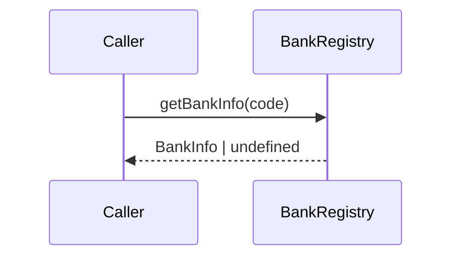

# BankRegistry

## Overview

Defines the canonical bank registry, including `BankInfo` metadata and lookup helpers for bank codes.

## Responsibilities

- Provide the `BankInfo` contract.
- Maintain the `BANKS` registry keyed by `BankCode`.
- Expose lookup and validation helpers.

## Inputs and outputs

- Inputs:
  - Bank code as `BankCode` or `string`.
- Outputs:
  - `BankInfo` or derived values (`name`) when available.
  - `boolean` for validity checks.

## API / Signature

```ts
export interface BankInfo {
  code: BankCode;
  name: string;
  shortName: string;
  ispb: string;
}

export const BANKS: Record<BankCode, BankInfo>;

export function getBankInfo(code: BankCode | string): BankInfo | undefined;
export function getBankName(code: BankCode | string): string | undefined;
export function isValidBankCode(code: string): boolean;
```

## Main flow



## Error handling and edge cases

- Returns `undefined` for unknown bank codes.
- `isValidBankCode()` returns `false` for unknown codes.

## Examples

```ts
import { getBankInfo, isValidBankCode } from '@constants/bancos';

const bank = getBankInfo('341');
const isValid = isValidBankCode('001');
```

## Dependencies and integrations

- Depends on `BankCode` from [src/enums/common](../../enums/common/index.ts).
