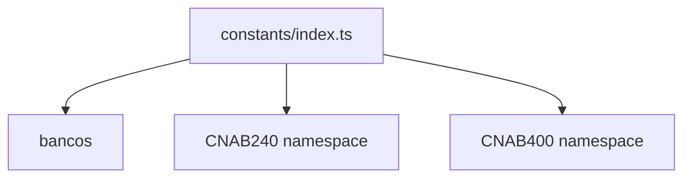

# constants/index.ts

## Overview

Central export point for bank constants and CNAB240/CNAB400 constant namespaces.

## Responsibilities

- Export bank metadata
- Provide CNAB240 and CNAB400 constants under separate namespaces

## Inputs and outputs

- Input: N/A
- Output: constant exports

## API / Signature

```ts
export * from './bancos'
export * as CNAB240 from './cnab240'
export * as CNAB400 from './cnab400'
```

## Main flow



## Error handling and edge cases

- No runtime logic

## Examples

```ts
import { BANKS, CNAB240 } from '@linkiez/boleto-sdk';
```

## Dependencies and integrations

- Used by generators, parsers, and validators
