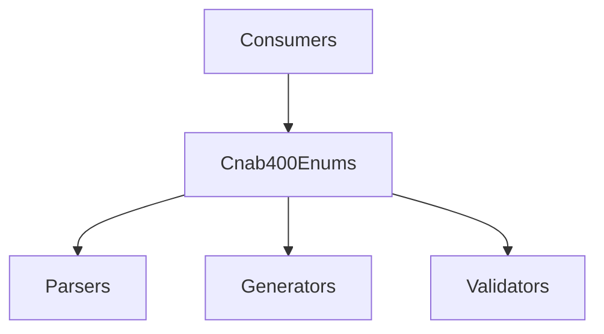

# Cnab400Enums

## Overview

Defines CNAB400-specific enum values for record types, operations, instructions, occurrences, species, portfolios, acceptance, and rejection reasons.

## Responsibilities

- Centralize CNAB400 enum values used across parsers, generators, and validators.
- Provide stable identifiers mapped to FEBRABAN and bank-specific codes.

## Inputs and outputs

- Inputs: None.
- Outputs: Enum values for CNAB400 codes.

## API / Signature

```ts
export enum RecordType { /* ... */ }
export enum OperationType { /* ... */ }
export enum RegistrationType { /* ... */ }
export enum InstructionCode { /* ... */ }
export enum OccurrenceCode { /* ... */ }
export enum SpeciesCodeCnab400 { /* ... */ }
export enum PortfolioCode { /* ... */ }
export enum AcceptanceTypeCnab400 { /* ... */ }
export enum RejectionReasonCode { /* ... */ }
```

## Main flow



## Error handling and edge cases

- None. Enums are static compile-time values.

## Examples

```ts
import { RecordType, InstructionCode } from '@enums/cnab400';

const type = RecordType.HEADER;
const instruction = InstructionCode.AUTO_PROTEST;
```

## Dependencies and integrations

- References CNAB400 documentation in doc/CNAB400-ITAU.md.
