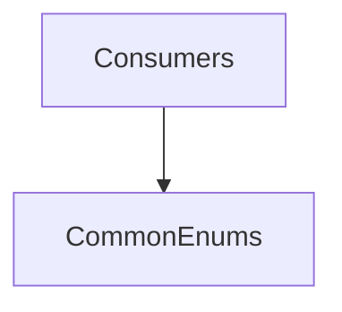

# CommonEnums

## Overview

Defines shared enum values used across CNAB 240/400 processing.

## Responsibilities

- Provide standardized identifiers for bank codes, document types, currencies, and instructions.
- Serve as shared constants for parsers, generators, validators, and templates.

## Inputs and outputs

- Inputs: None.
- Outputs: Enum values for common CNAB concepts.

## API / Signature

```ts
export enum BankCode { /* ... */ }
export enum DocumentType { /* ... */ }
export enum SpeciesCode { /* ... */ }
export enum AcceptanceType { /* ... */ }
export enum CurrencyCode { /* ... */ }
export enum CnabType { /* ... */ }
export enum MovementType { /* ... */ }
export enum InstructionCode { /* ... */ }
```

## Main flow



## Error handling and edge cases

- None. Enums are static compile-time values.

## Examples

```ts
import { BankCode, CnabType } from '@enums/common';

const bank = BankCode.BRADESCO;
const cnab = CnabType.CNAB240;
```

## Dependencies and integrations

- None.
