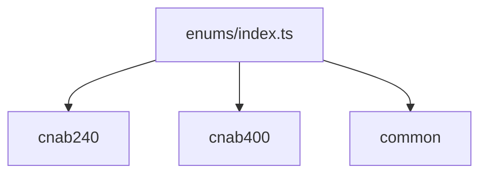

# enums/index.ts

## Overview

Aggregates CNAB240, CNAB400, and common enums with conflict-safe names.

## Responsibilities

- Re-export CNAB240 enums with prefixed names
- Re-export CNAB400 enums with prefixed names
- Re-export common enums

## Inputs and outputs

- Input: N/A
- Output: enum exports

## API / Signature

```ts
export { Cnab240OperationType, Cnab240RecordType, ... } from './cnab240'
export { Cnab400InstructionCode, Cnab400RecordType, ... } from './cnab400'
export { BankCode, DocumentType, CommonInstructionCode } from './common'
```

## Main flow



## Error handling and edge cases

- No runtime logic

## Examples

```ts
import { BankCode, Cnab240RecordType } from '@linkiez/boleto-sdk';
```

## Dependencies and integrations

- Used by types, parsers, generators, and validators
