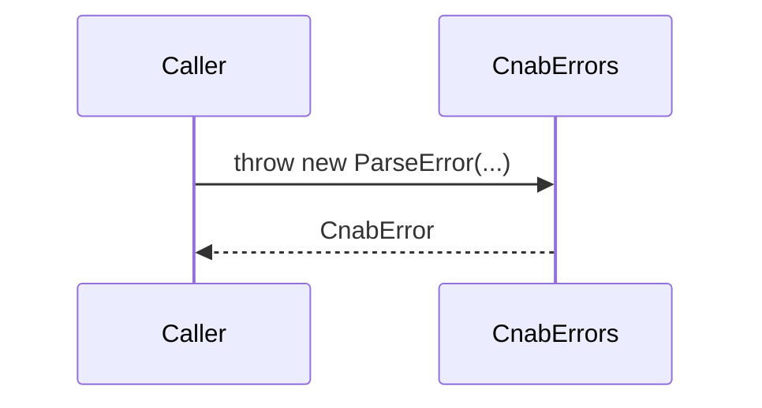

# CnabErrors

## Overview

Defines structured error classes used across the SDK for parsing, validation, and generation failures.

## Responsibilities

- Provide a base `CnabError` with error codes and context.
- Expose specialized error types for parsing, validation, and generation.

## Inputs and outputs

- Inputs: Error message and optional context data.
- Outputs: Typed error instances with consistent metadata.

## API / Signature

```ts
export class CnabError extends Error {
  readonly code?: string;
  readonly context?: Record<string, unknown>;
}

export class ParseError extends CnabError {
  readonly line?: number;
}

export class ValidationError extends CnabError {
  readonly issues?: Array<{ path: (string | number)[]; message: string; code?: string }>;
}

export class GenerationError extends CnabError {
  readonly field?: string;
}
```

## Main flow



## Error handling and edge cases

- `ValidationError` aggregates Zod-style issue metadata.
- `ParseError` includes line context when available.

## Examples

```ts
import { ParseError } from '@errors';

throw new ParseError('Invalid record type', 42);
```

## Dependencies and integrations

- No external dependencies.
