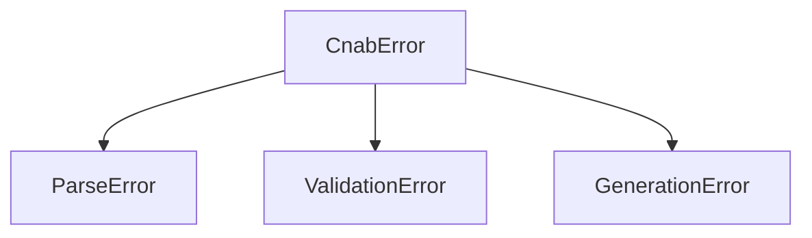

# errors/index.ts

## Overview

Custom error classes used throughout the SDK for parsing, validation, and generation failures.

## Responsibilities

- Provide structured error types with codes and context
- Represent parsing, validation, and generation failures

## Inputs and outputs

- Inputs: error message and optional metadata
- Outputs: error instances with metadata

## API / Signature

```ts
export class CnabError extends Error
export class ParseError extends CnabError
export class ValidationError extends CnabError
export class GenerationError extends CnabError
```

## Main flow



## Error handling and edge cases

- Preserves stack traces
- Includes optional `code` and `context` metadata

## Examples

```ts
throw new ParseError('Invalid line length', 3);
```

## Dependencies and integrations

- Used by parsers, validators, and generators
