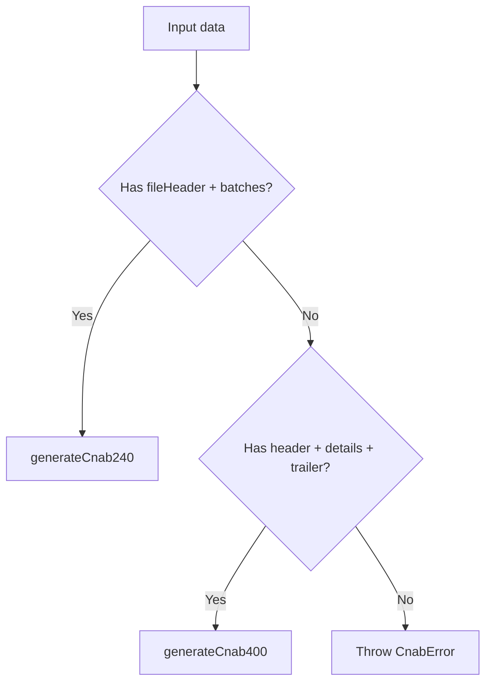

# CnabGeneratorFactory

## Overview

Factory function that selects the correct CNAB generator (240 or 400) based on the input structure.

## Responsibilities

- Detect CNAB format by inspecting the input shape
- Delegate generation to CNAB240 or CNAB400 generators
- Throw a meaningful error when the format is invalid

## Inputs and outputs

- Input: `Cnab240File | Cnab400File`
- Output: CNAB file content as a string

## API / Signature

```ts
export function generateCnab(data: Cnab240File | Cnab400File): string
```

## Main flow



## Error handling and edge cases

- Throws `CnabError` when the format cannot be determined
- Accepts only the known CNAB240 and CNAB400 structures

## Examples

```ts
import { generateCnab } from '@linkiez/boleto-sdk';

const content = generateCnab(cnab240File);
```

## Dependencies and integrations

- `generateCnab240` from `src/generators/cnab240`
- `generateCnab400` from `src/generators/cnab400`
- `CnabError` from `src/errors`
