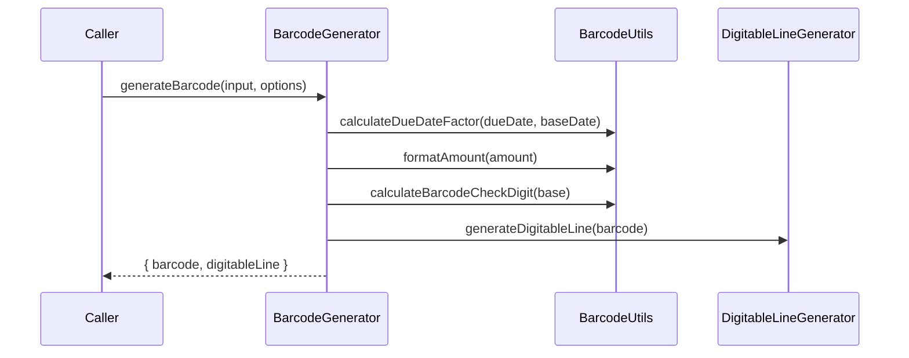

# BarcodeGenerator

## Overview

Generates the 44-digit boleto barcode and the formatted digitable line from core input fields.

## Responsibilities

- Validate numeric inputs and lengths
- Build barcode core fields (bank code, currency, due date factor, amount, free field)
- Calculate the general barcode check digit
- Produce the formatted digitable line

## Inputs and outputs

- Inputs: `BarcodeGenerationInput`, `BarcodeGenerationOptions`
- Output: `BarcodeResult`

## API / Signature

```ts
export interface BarcodeGenerationInput {
  bankCode: string;
  currencyCode?: string;
  dueDate: Date;
  amount: number;
  freeField: string;
}

export interface BarcodeGenerationOptions {
  baseDate?: Date;
}

export interface BarcodeResult {
  barcode: string;
  digitableLine: string;
}

export function generateBarcode(
  input: BarcodeGenerationInput,
  options?: BarcodeGenerationOptions
): BarcodeResult;
```

## Main flow



## Error handling and edge cases

- Throws when any numeric field contains non-digits
- Throws when `freeField` length is not 25 digits
- Throws for negative amounts or amounts exceeding 10-digit capacity
- Throws when due date factor is negative or exceeds 4 digits

## Examples

```ts
import { generateBarcode } from '@linkiez/boleto-sdk';

const result = generateBarcode({
  bankCode: '341',
  currencyCode: '9',
  dueDate: new Date(Date.UTC(2026, 1, 28)),
  amount: 150.0,
  freeField: '1234567890123456789012345',
});

console.log(result.barcode);
console.log(result.digitableLine);
```

## Dependencies and integrations

- Uses `BarcodeUtils` for validation and check digit calculation
- Uses `DigitableLineGenerator` for line formatting
