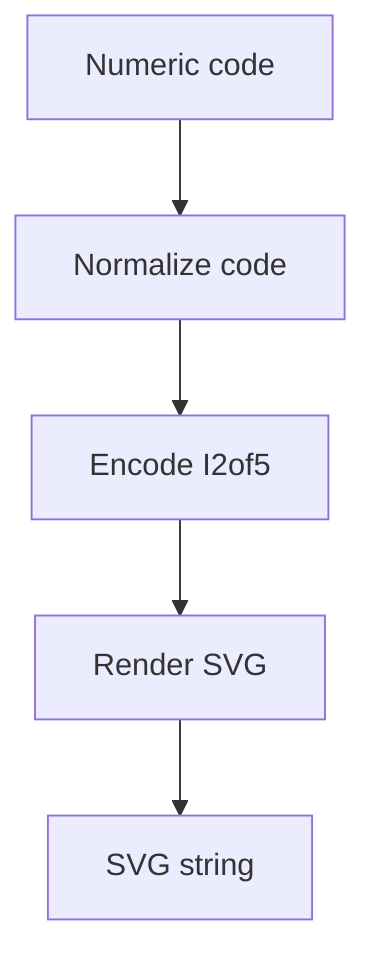

# BarcodeRenderer

## Overview

Renders Interleaved 2 of 5 (I2of5) barcodes as SVG.

## Responsibilities

- Encode numeric barcode strings using I2of5 patterns
- Render bars as SVG rectangles with configurable sizing

## Inputs and outputs

- Input: numeric barcode string, optional rendering options
- Output: SVG string

## API / Signature

```ts
export interface I2of5SvgOptions {
  height?: number;
  narrowWidth?: number;
  wideWidth?: number;
  quietZone?: number;
}

export function renderI2of5Svg(code: string, options?: I2of5SvgOptions): string;
```

## Main flow



## Error handling and edge cases

- Throws when code contains non-numeric characters
- Pads odd-length codes with a leading zero

## Examples

```ts
const svg = renderI2of5Svg('34100000000000000000000000000000000000000000');
```

## Dependencies and integrations

- Exposed via `src/generators/barcode/index.ts`
