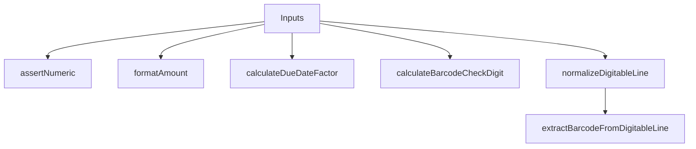

# BarcodeUtils

## Overview

Shared helpers for boleto barcode generation and validation.

## Responsibilities

- Validate numeric strings and lengths
- Format amount into 10-digit numeric field
- Calculate due date factor
- Calculate general barcode check digit
- Normalize and parse digitable lines

## Inputs and outputs

- Inputs: numeric strings, dates, or digitable lines
- Outputs: formatted strings and check digits

## API / Signature

```ts
export const DEFAULT_CURRENCY_CODE: string;
export const DEFAULT_BASE_DATE: Date;
export const BARCODE_LENGTH: number;
export const DIGITABLE_LINE_LENGTH: number;

export function assertNumeric(value: string, fieldName: string, length?: number): string;
export function formatAmount(amount: number): string;
export function calculateDueDateFactor(dueDate: Date, baseDate?: Date): string;
export function calculateBarcodeCheckDigit(value: string): string;
export function normalizeDigitableLine(digitableLine: string): string;
export function extractBarcodeFromDigitableLine(digitableLine: string): string;
```

## Main flow



## Error handling and edge cases

- Throws for non-numeric strings or incorrect lengths
- Throws for invalid dates or negative due date factor
- Throws for amounts exceeding 10-digit capacity

## Examples

```ts
import { calculateDueDateFactor, formatAmount } from '@linkiez/boleto-sdk';

const factor = calculateDueDateFactor(new Date(Date.UTC(2026, 1, 28)));
const amount = formatAmount(150.0); // "0000015000"
```

## Dependencies and integrations

- Uses padding utilities from `@utils/generators`
- Consumed by barcode generators and validators
