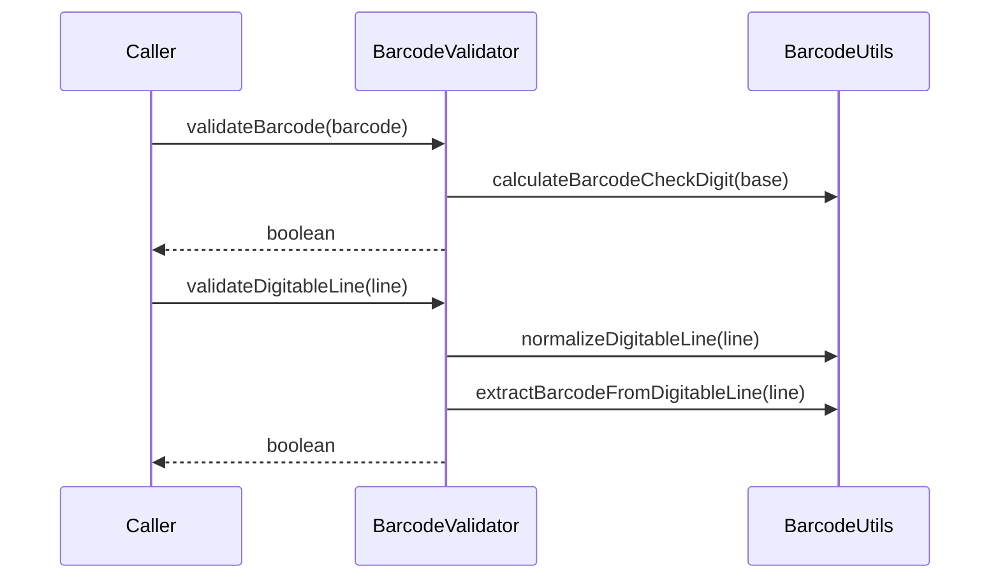

# BarcodeValidator

## Overview

Validates boleto barcodes and digitable lines, including check digits and field structure.

## Responsibilities

- Validate barcode length and check digit
- Validate digitable line field digits (modulo 10)
- Reconstruct barcode from digitable line for full validation

## Inputs and outputs

- Input: `barcode: string` or `digitableLine: string`
- Output: `boolean`

## API / Signature

```ts
export function validateBarcode(barcode: string): boolean;
export function validateDigitableLine(digitableLine: string): boolean;
```

## Main flow



## Error handling and edge cases

- Returns `false` for non-numeric input or incorrect lengths
- Returns `false` when any check digit does not match

## Examples

```ts
import { validateBarcode, validateDigitableLine } from '@linkiez/boleto-sdk';

const validBarcode = validateBarcode('00193373700000001000500940144816060680935031');
const validLine = validateDigitableLine('00190.00009 01234.567890 12345.678901 3 33700000000100');
```

## Dependencies and integrations

- Uses `calculateModulo10` from `@utils/generators`
- Uses `BarcodeUtils` to normalize and extract barcode data
