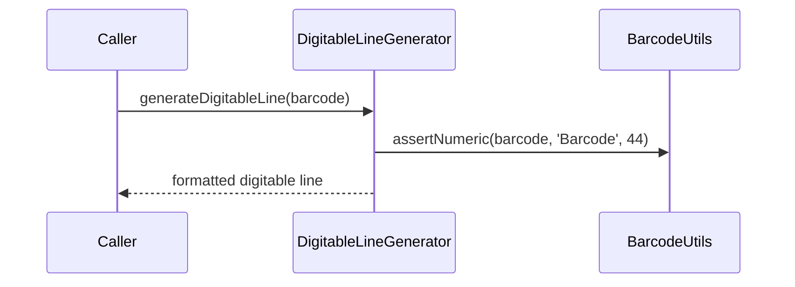

# DigitableLineGenerator

## Overview

Builds the formatted 47-digit digitable line from a 44-digit boleto barcode.

## Responsibilities

- Validate barcode length and numeric content
- Split barcode fields and compute modulo 10 digits
- Format the digitable line with dots and spaces

## Inputs and outputs

- Input: `barcode: string`
- Output: `string` (formatted digitable line)

## API / Signature

```ts
export function generateDigitableLine(barcode: string): string;
```

## Main flow



## Error handling and edge cases

- Throws when barcode is not 44 numeric digits

## Examples

```ts
import { generateDigitableLine } from '@linkiez/boleto-sdk';

const line = generateDigitableLine('00193373700000001000500940144816060680935031');
console.log(line);
```

## Dependencies and integrations

- Uses `calculateModulo10` from `@utils/generators`
- Consumed by `BarcodeGenerator`
