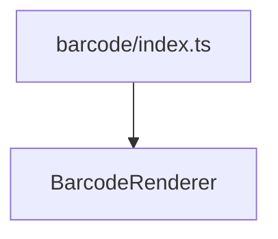

# generators/barcode/index.ts

## Overview

Exports barcode rendering utilities.

## Responsibilities

- Provide public exports for barcode generators/renderers

## Inputs and outputs

- Input: N/A
- Output: Barcode exports

## API / Signature

```ts
export * from './BarcodeRenderer';
```

## Main flow



## Error handling and edge cases

- No runtime logic

## Examples

```ts
import { renderI2of5Svg } from '@linkiez/boleto-sdk';
```

## Dependencies and integrations

- Used by `src/generators/index.ts`
