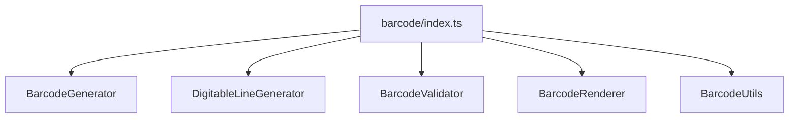

# generators/barcode/index.ts

## Overview

Exports barcode generation, rendering, and validation utilities.

## Responsibilities

- Provide public exports for barcode generators, renderers, and validators

## Inputs and outputs

- Input: N/A
- Output: Barcode exports

## API / Signature

```ts
export * from './BarcodeGenerator';
export * from './BarcodeRenderer';
export * from './BarcodeUtils';
export * from './BarcodeValidator';
export * from './DigitableLineGenerator';
```

## Main flow



## Error handling and edge cases

- No runtime logic

## Examples

```ts
import { generateBarcode, renderI2of5Svg } from '@linkiez/boleto-sdk';
```

## Dependencies and integrations

- Used by `src/generators/index.ts`
