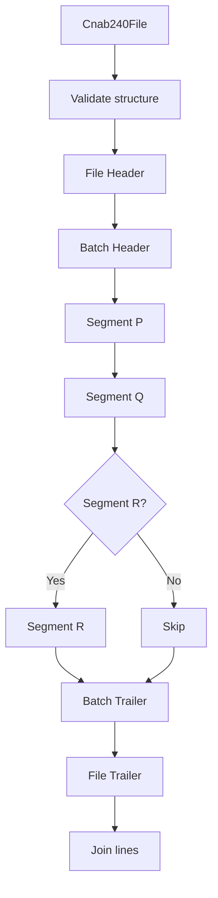

# Cnab240Generator

## Overview

Generates a complete CNAB240 file from a structured `Cnab240File` object.

## Responsibilities

- Validate the CNAB240 file structure
- Generate file header, batches, details, and file trailer
- Include optional Segment R when present
- Return the full content as newline-separated lines

## Inputs and outputs

- Input: `Cnab240File`
- Output: CNAB240 file content string

## API / Signature

```ts
export class Cnab240Generator {
  generate(file: Cnab240File): string;
}
```

## Main flow



## Error handling and edge cases

- Throws when file header or trailer is missing
- Throws when batches or details are missing
- Throws when Segment P or Segment Q is missing

## Examples

```ts
import { Cnab240Generator } from '@linkiez/boleto-sdk';

const generator = new Cnab240Generator();
const content = generator.generate(file);
```

## Dependencies and integrations

- `FileHeaderGenerator`, `FileTrailerGenerator`
- `BatchHeaderGenerator`, `BatchTrailerGenerator`
- `SegmentPGenerator`, `SegmentQGenerator`, `SegmentRGenerator`
