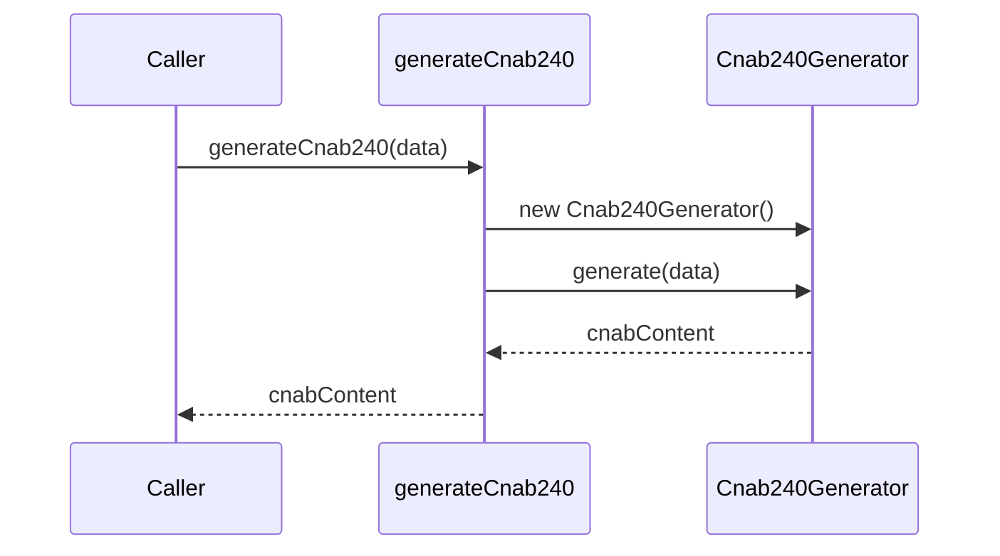

# GenerateCnab240

## Overview

`GenerateCnab240.ts` exposes a convenience function that builds a CNAB 240 file string from structured data using the `Cnab240Generator` class.

## Responsibilities

- Provide a simple entry point for CNAB 240 generation.
- Delegate the full generation process to `Cnab240Generator`.

## Inputs and outputs

- **Input:** `Cnab240File` data structure.
- **Output:** CNAB 240 file content as a string.

## API / Signature

```ts
export function generateCnab240(data: Cnab240File): string {
  const generator = new Cnab240Generator();
  return generator.generate(data);
}
```

## Main flow



## Error handling and edge cases

- Propagates errors thrown by `Cnab240Generator.generate`, such as validation or formatting errors.
- Does not perform additional validation; input should already match `Cnab240File` requirements.

## Examples

```ts
import { generateCnab240 } from '@/generators/cnab240';

const content = generateCnab240(cnab240FileData);
```

## Dependencies and integrations

- `Cnab240Generator` for the actual generation logic.
- `Cnab240File` type for input structure.
