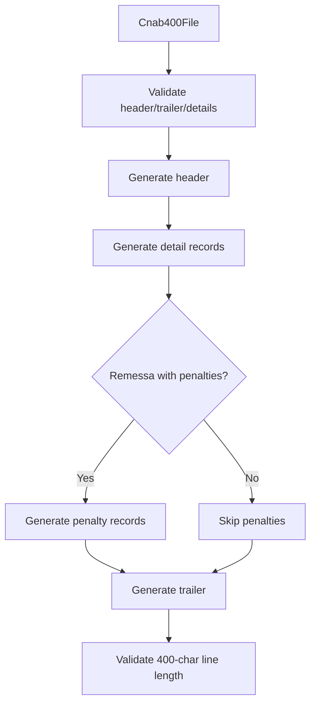

# Cnab400Generator

## Overview

Generates a CNAB400 file from a `Cnab400File` structure, including header, detail records, optional penalty records, and trailer.

## Responsibilities

- Validate required file sections
- Generate header, details, optional penalty records, and trailer
- Enforce 400-character line length

## Inputs and outputs

- Input: `Cnab400File`
- Output: CNAB400 file content string

## API / Signature

```ts
export function generateCnab400(file: Cnab400File): string
```

## Main flow



## Error handling and edge cases

- Throws `GenerationError` when file structure is invalid
- Throws when any generated line is not 400 characters
- Supports REMESSA vs RETORNO detail record generation

## Examples

```ts
import { generateCnab400 } from '@linkiez/boleto-sdk';

const content = generateCnab400(file);
```

## Dependencies and integrations

- `generateFileHeader`
- `generateDetailRecord` and `generateDetailRecordRemessa`
- `generatePenaltyRecord`
- `generateFileTrailer`
- `GenerationError`
