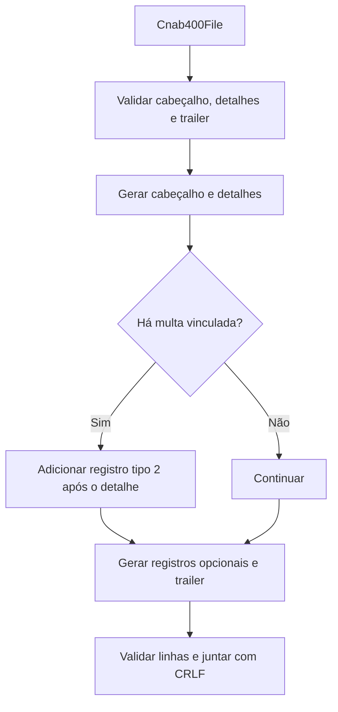

# Cnab400Generator

## Visão geral

Gera um arquivo CNAB400 a partir de `Cnab400File`, incluindo cabeçalho, detalhes, multas vinculadas opcionais, mensagens de frente e trailer.

## Responsabilidades

- Validar as seções obrigatórias do arquivo.
- Gerar cabeçalho, detalhes e registros opcionais vinculados.
- Aplicar o formato do trailer conforme o tipo de operação: posições 002–394 em branco na remessa Itaú e totais preservados no retorno.
- Garantir linhas de 400 caracteres, separadas e terminadas por CRLF.

Registros Itaú tipo 7 usam código flash, linhas de mensagem, número de linha, código de destino e número sequencial.

## Entradas e saídas

- Entrada: `Cnab400File`.
- Saída: conteúdo CNAB400 com cada registro de 400 caracteres terminado por CRLF.

## API / Assinatura

```ts
export function generateCnab400(file: Cnab400File): string;
```

## Fluxo principal


```mermaid
flowchart TD
  A[Cnab400File] --> B[Validar cabeçalho, detalhes e trailer]
  B --> C[Gerar cabeçalho e detalhes]
  C --> D{Há multa vinculada?}
  D -->|Sim| E[Adicionar registro tipo 2 após o detalhe]
  D -->|Não| F[Continuar]
  E --> G[Gerar registros opcionais e trailer]
  F --> G
  G --> H[Validar linhas e juntar com CRLF]
```

## Tratamento de erros e casos-limite

- Lança `GenerationError` quando a estrutura do arquivo ou o comprimento de uma linha é inválido.
- Cada multa deve apontar para exatamente um detalhe e cada detalhe pode ter no máximo uma multa.
- Registros tipo 2 são emitidos após o detalhe correspondente.
- O tipo de operação do cabeçalho escolhe a geração de detalhe e trailer para REMESSA ou RETORNO.
- O cabeçalho de remessa mantém as posições 101–394 em branco; campos exclusivos do retorno ocupam posições 101–119.

## Exemplos

```ts
import { generateCnab400 } from '@linkiez/boleto-sdk';

const content = generateCnab400(file);
```

## Dependências e integrações

- `generateFileHeader`
- `generateDetailRecord` e `generateDetailRecordRemessa`
- `generatePenaltyRecord` e `generateMessageFrontRecord`
- `generateFileTrailer`
- `GenerationError`
