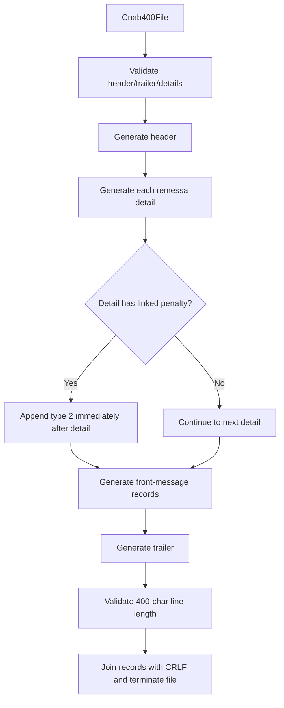

# Cnab400Generator

## Overview

Generates a CNAB400 file from a `Cnab400File` structure, including header, detail records, optional linked penalty and front-message records, and trailer.

## Responsibilities

- Validate required file sections
- Generate the header, each detail with its optional linked penalty record, optional front-message records, and trailer
- Enforce 400-character line length
- Separate records with CRLF and terminate the trailer with CRLF

Itaú type 7 records use a three-character flash code, three message lines of 128, 128, and 127 characters, a two-digit print-line number before each message, a destination code, and a six-digit sequence number.

## Inputs and outputs

- Input: `Cnab400File`
- Output: CNAB400 file content string with each 400-character record terminated by CRLF

## API / Signature

```ts
export function generateCnab400(file: Cnab400File): string;
```

## Main flow


```mermaid
flowchart TD
  A[Cnab400File] --> B[Validate header/trailer/details]
  B --> C[Generate header]
  C --> D[Generate each remessa detail]
  D --> E{Detail has linked penalty?}
  E -->|Yes| F[Append type 2 immediately after detail]
  E -->|No| G[Continue to next detail]
  F --> H[Generate front-message records]
  G --> H
  H --> I[Generate trailer]
  I --> J[Validate 400-char line length]
  J --> K[Join records with CRLF and terminate file]
```

## Error handling and edge cases

- Throws `GenerationError` when file structure is invalid
- Throws when any generated line is not 400 characters
- A remittance penalty must reference exactly one detail by `detailCompanyControl` or a valid `detailIndex`; for a single-detail file, the link may be omitted.
- A detail may have at most one penalty record. Linked type 2 records are emitted immediately after their type 1 detail and are included in the caller-provided trailer totals/sequences.
- Supports REMESSA vs RETORNO detail record generation

## Examples

```ts
import { generateCnab400 } from '@linkiez/boleto-sdk';

const content = generateCnab400(file);
```

## Dependencies and integrations

- `generateFileHeader`
- `generateDetailRecord` and `generateDetailRecordRemessa`
- `generatePenaltyRecord`
- `generateFileTrailer`
- `generateMessageFrontRecord`
- `GenerationError`
