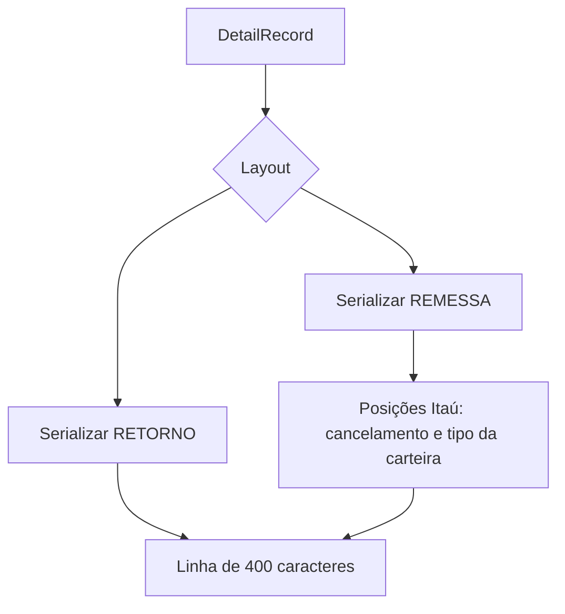

# DetailRecordGenerator (CNAB400)

## Visão geral

Serializa registros detalhe tipo 1 para os layouts CNAB400 de remessa e retorno.

## Responsabilidades

- Gerar linhas de 400 caracteres com campos nas posições definidas pelo layout.
- Serializar dados comuns de beneficiário, pagador, título e instruções.
- Na remessa Itaú, preencher com zeros a quantidade de moeda variável usada para Real.
- Na remessa Itaú, serializar espécie, códigos de instrução, bairro do pagador, juros, desconto, protesto, código de cancelamento e tipo de carteira quando fornecidos.

## Entradas e saídas

- Entrada: `DetailRecord` validado.
- Saída: linha CNAB400 de 400 caracteres.

## Fluxo principal



## Tratamento de erros e casos-limite

- Campos opcionais sem valor ocupam espaços em branco ou o preenchimento definido pelo layout; a quantidade de moeda variável é zero para títulos em Real.
- O bairro do pagador ocupa até 12 caracteres nas posições 315–326 da remessa Itaú.
- A estrutura validada pelo `DetailRecordSchema` mantém os campos opcionais e seus limites.
- O teste verifica comprimento, offsets Itaú e compatibilidade com o parser/validador do banco.

## Exemplos

```ts
const line = generateDetailRecordRemessa(detailRecord);
```

## Dependências e integrações

- `DetailRecord` e `DetailRecordSchema`.
- Formatadores de data, decimal e preenchimento.
- Parser e validador Itaú CNAB400.
