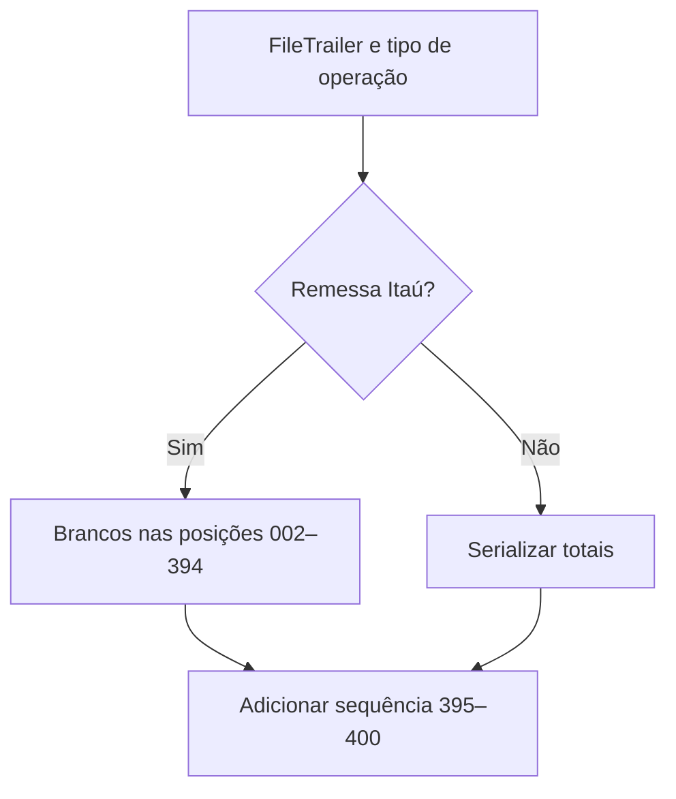

# FileTrailerGenerator

## Visão geral

Gera o registro trailer tipo 9 de um arquivo CNAB400.

## Responsabilidades

- Serializar totais do trailer quando o formato os utiliza.
- Para remessa Itaú, deixar as posições 002–394 em branco e manter o número sequencial nas posições 395–400.

## Entradas e saídas

- Entrada: `FileTrailer` e tipo de operação (`1` para remessa, `2` para retorno).
- Saída: linha CNAB400 com exatamente 400 caracteres.

## API / Assinatura

```ts
export function generateFileTrailer(
  trailer: FileTrailer,
  operationType: '1' | '2' = '2',
): string;
```

## Fluxo principal



## Tratamento de erros e casos-limite

- Chamadas sem tipo de operação mantêm a serialização anterior de totais.
- O número sequencial usa `sequentialNumber` ou, quando ausente, `totalRecords`.

## Exemplos

```ts
const line = generateFileTrailer(trailer, '1');
```

## Dependências e integrações

- `FileTrailer`
- `FILE_TRAILER_SIZES`
- Formatadores decimais e preenchimento.
