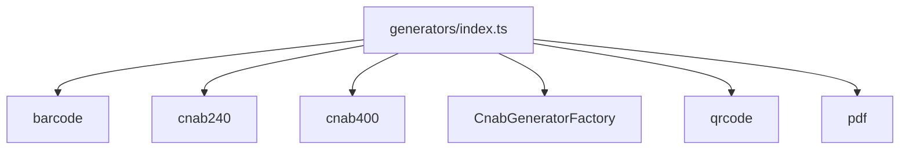

# generators/index.ts

## Overview

Aggregates public generator exports.

## Responsibilities

- Re-export generator modules (CNAB, barcode, factories)

## Inputs and outputs

- Input: N/A
- Output: Generator exports

## API / Signature

```ts
export * from './barcode';
export * from './cnab240';
export * from './cnab400';
export * from './CnabGeneratorFactory';
export * from './qrcode';
export * from './pdf';
```

## Main flow



## Error handling and edge cases

- No runtime logic

## Examples

```ts
import {
  generateBarcode,
  generateBoletoPdfBuffer,
  generatePixQRCode,
  renderI2of5Svg,
} from '@linkiez/boleto-sdk';
```

## Dependencies and integrations

- Exported by `src/index.ts`
