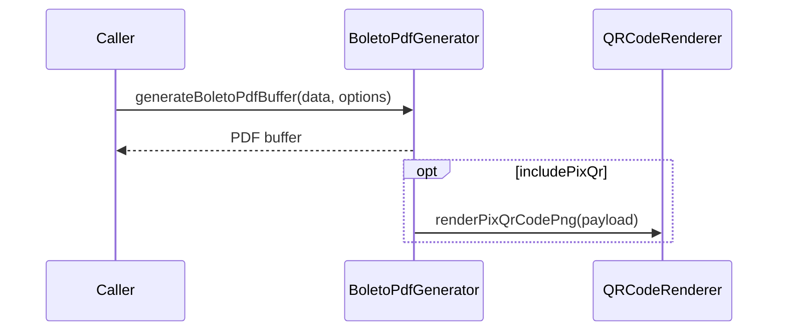

# BoletoPdfGenerator

## Overview

Generates a minimal PDF representation of a boleto using PDFKit.

## Responsibilities

- Render core boleto fields into a PDF
- Render instructions and additional info based on layout
- Render labels in pt-BR
- Optionally embed PIX QR code image
- Return PDF as a `Buffer`

## Inputs and outputs

- Input: `BoletoTemplateData`, `BoletoPdfOptions`
- Output: `Promise<Buffer>`

## API / Signature

```ts
export interface BoletoPdfOptions {
  title?: string;
  author?: string;
  includePixQr?: boolean;
  pageSize?: string | [number, number];
  layout?: 'simple' | 'instructions' | 'detailed';
  compress?: boolean;
}

export async function generateBoletoPdfBuffer(
  data: BoletoTemplateData,
  options?: BoletoPdfOptions
): Promise<Buffer>;
```

## Main flow



## Error handling and edge cases

- Propagates PDFKit or QR rendering errors
- PIX QR code is rendered only when `includePixQr` is true and payload is present
- Instructions and additional info are rendered according to the `layout` option

## Examples

```ts
import { generateBoletoPdfBuffer } from '@linkiez/boleto-sdk';

const buffer = await generateBoletoPdfBuffer(data, {
  title: 'Boleto - ITAU',
  includePixQr: true,
  layout: 'detailed',
  compress: false,
});
```

## Dependencies and integrations

- Uses `pdfkit`
- Uses `QRCodeRenderer` for PIX QR code images
