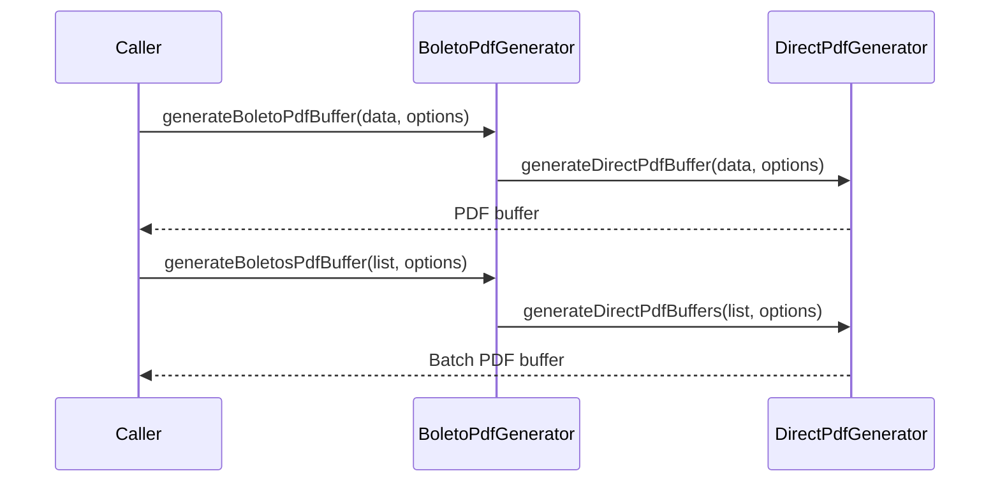

# BoletoPdfGenerator

## Overview

Backwards-compatible public entrypoint for boleto PDF generation.

## Responsibilities

- Preserve the existing `generateBoletoPdfBuffer` API contract.
- Delegate actual PDF creation to `DirectPdfGenerator`.
- Expose batch generation through `generateBoletosPdfBuffer`.
- Expose stream-based generation APIs for large boleto batches.

## Inputs and outputs

- Input: `BoletoTemplateData`, `BoletoPdfOptions`
- Output: `Promise<Buffer>` or `Promise<Readable>`

## API / Signature

```ts
export interface BoletoPdfOptions {
  title?: string;
  author?: string;
  includePixQr?: boolean;
  pageSize?: string | [number, number];
  layout?: 'simple' | 'instructions' | 'detailed';
  compress?: boolean;
  boletosPerPage?: number;
  sectionSpacing?: number;
  margins?: number | { top?: number; right?: number; bottom?: number; left?: number };
  bleed?: number;
  fonts?: {
    regularPath?: string;
    boldPath?: string;
    monoPath?: string;
  };
}

export async function generateBoletoPdfBuffer(
  data: BoletoTemplateData,
  options?: BoletoPdfOptions
): Promise<Buffer>;

export async function generateBoletoPdfStream(
  data: BoletoTemplateData,
  options?: BoletoPdfOptions
): Promise<Readable>;

export async function generateBoletosPdfBuffer(
  dataList: BoletoTemplateData[],
  options?: BoletoPdfOptions,
): Promise<Buffer>;

export async function generateBoletosPdfStream(
  dataList: BoletoTemplateData[],
  options?: BoletoPdfOptions,
): Promise<Readable>;
```

## Main flow



## Error handling and edge cases

- Propagates generation errors from `DirectPdfGenerator`.

## Examples

```ts
import { generateBoletoPdfBuffer } from '@linkiez/boleto-sdk';

const buffer = await generateBoletoPdfBuffer(data, {
  title: 'Boleto - ITAU',
  includePixQr: true,
  layout: 'detailed',
  compress: false,
});
```

## Dependencies and integrations

- Uses `pdfkit`
- Uses `QRCodeRenderer` for PIX QR code images
