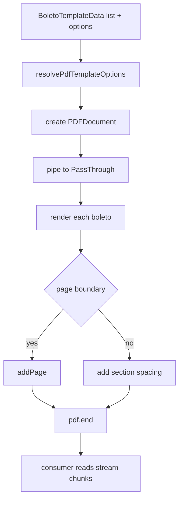

# DirectPdfGenerator

## Overview

Orchestrates boleto PDF generation directly with PDFKit, supporting both buffer and stream outputs.

## Responsibilities

- Resolve template options.
- Initialize PDFKit document metadata and page setup.
- Register embedded fonts when configured.
- Delegate section rendering to `PdfRenderer`.
- Return PDF as `Buffer` or `Readable` stream.
- Handle multi-boleto pagination in batch generation.
- Stream PDF output in-memory without temporary files.
- Propagate rendering and PDF engine failures through stream `error` events.

## Inputs and outputs

- Input: `BoletoTemplateData`, optional `PdfTemplateOptions`
- Output: `Promise<Buffer>` or `Promise<Readable>`

## API / Signature

```ts
export async function generateDirectPdfBuffer(
  data: BoletoTemplateData,
  options?: PdfTemplateOptions,
  dependencies?: PdfRendererDependencies,
): Promise<Buffer>;

export async function generateDirectPdfStream(
  data: BoletoTemplateData,
  options?: PdfTemplateOptions,
  dependencies?: PdfRendererDependencies,
): Promise<Readable>;

export async function generateDirectPdfBuffers(
  dataList: BoletoTemplateData[],
  options?: PdfTemplateOptions,
  dependencies?: PdfRendererDependencies,
): Promise<Buffer>;

export async function generateDirectPdfStreams(
  dataList: BoletoTemplateData[],
  options?: PdfTemplateOptions,
  dependencies?: PdfRendererDependencies,
): Promise<Readable>;
```

## Main flow



## Error handling and edge cases

- Rejects promise if PDFKit emits `error`.
- Propagates rendering errors from `PdfRenderer`.
- Emits stream `error` when PDF rendering fails in async generation.
- Throws when boleto list is empty in batch generation.
- Throws when an embedded font path is invalid or not a regular file.

## Examples

```ts
const buffer = await generateDirectPdfBuffer(data, { layout: 'detailed' });

const batchBuffer = await generateDirectPdfBuffers([dataA, dataB], {
  boletosPerPage: 2,
  sectionSpacing: 20,
});
```

## Dependencies and integrations

- Uses `pdfkit` as rendering engine.
- Integrates with `PdfTemplate` and `PdfRenderer`.