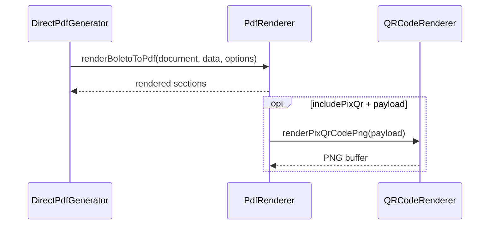

# PdfRenderer

## Overview

Renders boleto sections into an active PDFKit document.

## Responsibilities

- Render core boleto identity and payment fields.
- Render optional sections based on layout flags.
- Render barcode as a PNG image (I2of5) when `includeBarcode` is enabled (default).
- Fall back to plain text barcode when `includeBarcode` is false.
- Render PIX payload and QR image when enabled.
- Apply configurable font families (regular, bold, monospaced) when provided by generator dependencies.

## Inputs and outputs

- Input: `PDFDocument`, `BoletoTemplateData`, `ResolvedPdfTemplateOptions`
- Output: `Promise<void>`

## API / Signature

```ts
export async function renderBoletoToPdf(
  document: InstanceType<typeof PDFDocument>,
  data: BoletoTemplateData,
  options: ResolvedPdfTemplateOptions,
  dependencies?: PdfRendererDependencies,
): Promise<void>;
```

## Main flow



## Error handling and edge cases

- Propagates QR renderer errors to caller.
- Omits PIX rendering when payload is not available.
- Validates PIX payload before rendering the QR image.
- Omits optional sections according to layout mode.

## Examples

```ts
await renderBoletoToPdf(pdf, data, resolvedOptions);
```

## Dependencies and integrations

- Uses `@utils/formatters` for monetary values.
- Integrates with `QRCodeRenderer` for PIX QR PNG generation.