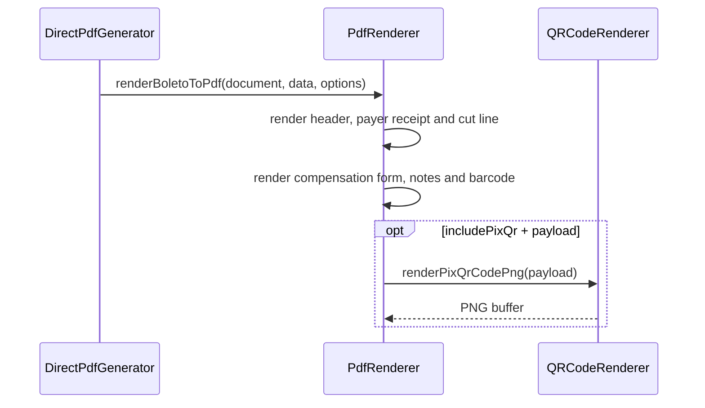

# PdfRenderer

## Overview

Renders a detachable payer receipt and a compact bank compensation form into
an active PDFKit document, using the JCM visual reference: a restrained header,
open two-column receipt, a prominent payment summary and a compact bank grid.

## Responsibilities

- Render core boleto identity and payment fields.
- Render optional sections based on layout flags.
- Render barcode as a PNG image (I2of5) when `includeBarcode` is enabled (default).
- Fall back to plain text barcode when `includeBarcode` is false.
- Render PIX payload and QR image when enabled.
- Apply configurable font families (regular, bold, monospaced) when provided by generator dependencies.
- Display actual beneficiary/payer names, documents and addresses in measured cells.
- Display the optional company name and logo in the header without changing the
  boleto beneficiary. Use company initials when supported logo bytes are absent
  or invalid.
- Use borderless party details, an 18-point amount and a 12-point JCM-red due date
  in the receipt summary. Keep smaller type and fine gray rules in the bank form.
- Align the bank form's right-hand fields to a shared column; extend adjustment
  rows to the full notes-panel height when instructions need extra room.
- Keep barcode bytes, payment identifiers and amounts unchanged.
- Keep PIX optional: a validated QR code in the header and selectable copy/paste
  payload in an unboxed footer, without browser controls or external assets.

## Inputs and outputs

- Input: `PDFDocument`, `BoletoTemplateData`, `ResolvedPdfTemplateOptions`
- Output: `Promise<void>`
- Header brand: `data.company.name` and optional PNG/JPEG `data.company.logo`;
  beneficiary information remains in the receipt and compensation form.
- The `simple` layout omits instructions and extra metadata; `instructions`
  includes instructions; `detailed` includes both inside the notes panel.
- Reuses the HTML template's optional `additionalInfo` keys:
  `agenciaCodigoCedente`, `dataDocumento`, `dataProcessamento`, `especie`,
  `aceite`, `localPagamento` and `Carteira`/`carteira`. `walletCode` is also
  accepted for the backend's existing payload. Values already shown in the
  form are not repeated in the notes panel.
- Missing dates, agency information, species and acceptance are shown as `-`.
  Adjustment and charged-value fields remain blank: this renderer does not
  calculate charges, invent amounts, or assert bank/CIP registration.

## API / Signature

```ts
export async function renderBoletoToPdf(
  document: InstanceType<typeof PDFDocument>,
  data: BoletoTemplateData,
  options: ResolvedPdfTemplateOptions,
  dependencies?: PdfRendererDependencies,
): Promise<void>;
```

## Main flow


```mermaid
sequenceDiagram
  participant Caller as DirectPdfGenerator
  participant Renderer as PdfRenderer
  participant QR as QRCodeRenderer
  Caller->>Renderer: renderBoletoToPdf(document, data, options)
  Renderer->>Renderer: render header, payer receipt and cut line
  Renderer->>Renderer: render compensation form, notes and barcode
  opt includePixQr + payload
    Renderer->>QR: renderPixQrCodePng(payload)
    QR-->>Renderer: PNG buffer
  end
```

## Error handling and edge cases

- Propagates QR renderer errors to caller.
- Omits PIX rendering when payload is not available.
- Validates PIX payload before rendering the QR image.
- Omits optional sections according to layout mode.
- Cells grow to fit wrapped labels, values and addresses; no silent ellipsis.
  Whole rows move to the next page when necessary. Long lists of instructions
  and extra metadata use continuation rows.
- A single cell/block larger than the printable page fails explicitly instead
  of clipping financial data. Very narrow columns also fail explicitly.
- Normal A4 samples with five instructions, metadata and PIX fit one page.
  Large content can require additional pages.
- Bank code/name are supplied data, not a hard-coded bank logo or fabricated
  check digit. The design-reference sample's payer data and registration badges
  are not copied into generated documents.
- Company logo data is limited to small PNG/JPEG buffers with plausible image
  headers; malformed PDFKit image data falls back to company initials.

## Examples

```ts
await renderBoletoToPdf(pdf, data, resolvedOptions);
```

## Dependencies and integrations

- Uses `@utils/formatters` for monetary values.
- Integrates with `QRCodeRenderer` for PIX QR PNG generation.
- Uses [PdfFormCanvas](./PdfFormCanvas.ts) for shared geometry and typography.
- Uses PDFKit's built-in fonts by default; no network access or browser is needed.