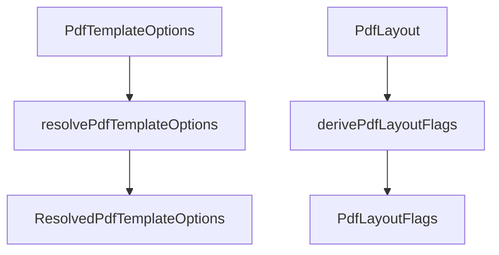

# PdfTemplate

## Overview

Defines PDF rendering options and default resolution behavior.

## Responsibilities

- Model template options used by PDF generation.
- Resolve optional inputs into stable defaults.
- Expose layout flags for conditional section rendering.
- Normalize pagination and spacing options for batch rendering.

## Inputs and outputs

- Input: `PdfTemplateOptions` and `PdfLayout`
- Output: `ResolvedPdfTemplateOptions` and `PdfLayoutFlags`

## API / Signature

```ts
export function resolvePdfTemplateOptions(
  options?: PdfTemplateOptions,
): ResolvedPdfTemplateOptions;

export function derivePdfLayoutFlags(layout: PdfLayout): PdfLayoutFlags;
```

Resolved options include:

- `boletosPerPage`: number of boleto sections rendered before creating a new page.
- `sectionSpacing`: additional vertical spacing between boleto sections in the same page.
- `margins`: configurable content margins for all page sides.
- `bleed`: additional print bleed area added on top of margins.
- `fonts`: optional embedded font file paths for regular, bold, and monospaced text.
- `includeBarcode`: whether to render the barcode as a PNG image (default `true`). When `false`, the raw barcode string is rendered as plain text instead.
- `barcode`: target rendering dimensions for the barcode PNG image (`width` in points, default 350; `height` in points, default 50).

## Main flow



## Error handling and edge cases

- No runtime exceptions expected for valid layout literals.
- Missing options are replaced by defaults.

## Examples

```ts
const resolved = resolvePdfTemplateOptions({ layout: 'simple', compress: false });
const flags = derivePdfLayoutFlags(resolved.layout);
```

## Dependencies and integrations

- Consumed by `DirectPdfGenerator` and `PdfRenderer`.